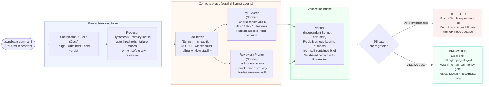
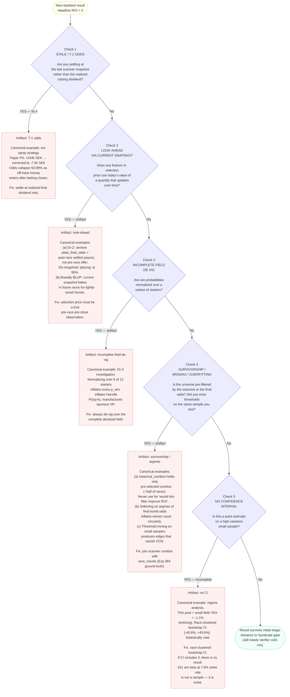
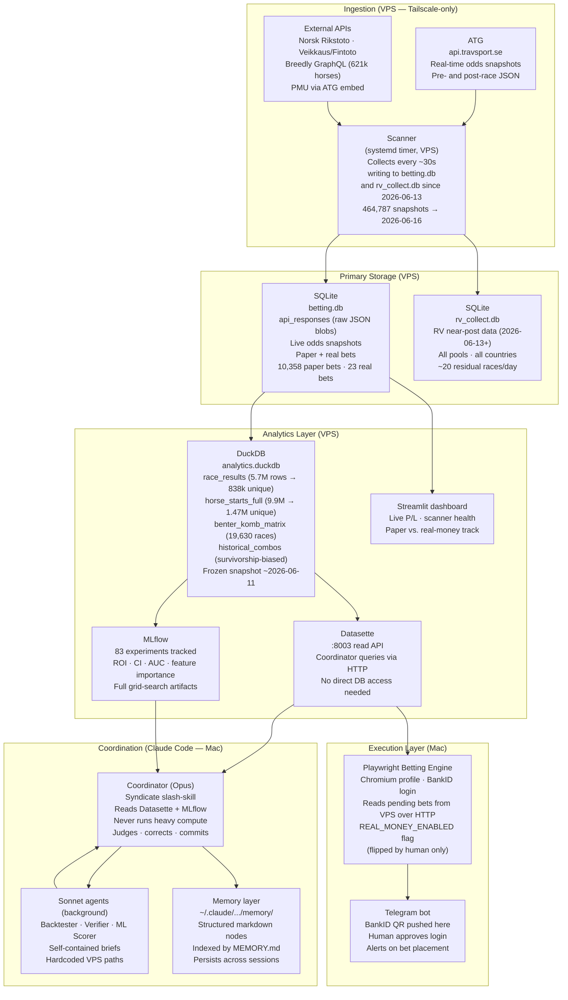

These four diagrams recur or are referenced across multiple posts in the "How I Failed to Beat the
Tote" series. Each diagram has a canonical home in one specific post where it appears at full size;
subsequent posts reuse a compact sidebar variant. This page is the master reference — the single
source of truth for titles, data, and annotations. If a number or label differs between a post and
this page, this page wins.

---

## Infographic 1 — The Syndicate: How a Sprint Is Run

**Canonical appearance:** Post 4 (`the-syndicate-research-loop`).
**Sidebar reuse:** Posts 5, 6, 7, 8 (compact "current sprint" variant with live counts).

One slash-command spins up six distinct roles that enforce pre-registration discipline; a result
only advances if it passes five mechanical criteria set before the backtester runs.

<figure>



<figcaption>One slash-command spawns six roles; a result only advances when all five pre-registered gate criteria pass.</figcaption>
</figure>

---

## Infographic 2 — The False-Positive Checklist

**Canonical appearance:** Post 3 (`t1-odds-bug`), where item 1 is introduced.
**Sidebar reuse:** Posts 4–8, adding one item per post as each new artifact appears.
**Standalone card:** Post 9 (`capstone`) shows the complete five-item version with provenance.

Every promising result in this project dissolved because of one of five recurring data artifacts.
The checklist is the autopsy key — each item was written after a specific investigation, not before.

<figure>



<figcaption>Five recurring data artifacts that dissolved every promising backtest result — a postmortem checklist, not a prospective design.</figcaption>
</figure>

---

## Infographic 3 — The Data Flow Architecture

**Canonical appearance:** Post 2 (`tote-mechanics-primer`).
**Sidebar reuse:** Posts 3, 9 (compact variant showing only the layer relevant to that post's story).

A single ATG API feeds a scanner that writes to SQLite on the VPS; a DuckDB analytics layer sits on
top for research; MLflow, Datasette, and a Streamlit dashboard serve the coordinator; a Mac-side
Playwright engine reads from the VPS over HTTP and places bets through a BankID-authenticated
Chromium profile.

<figure>



<figcaption>End-to-end data flow: ATG API → VPS scanner → SQLite/DuckDB → Datasette → Mac Playwright engine; coordinator (Opus) reads results and delegates compute to cheap Sonnet agents.</figcaption>
</figure>

---

## Infographic 4 — The Timeline (Feb–Jun 2026)

**Canonical appearance:** Post 1 (`series-intro-two-failure-modes`).
**Sidebar reuse:** Post 9 (`capstone`) as a compact retrospective.

Four months from first scanner run to closeout; the infrastructure migrated once (Pi to VPS,
May 24); real money was paused the day a research result cast doubt on the edge; 84 experiments
clustered into recognizable arcs.

<figure>
  <div class="placeholder">📊 Chart: 4-month program timeline · render with the matplotlib code below</div>
  <figcaption>Timeline of the program from first paper bets through closeout.</figcaption>
</figure>

```python
import matplotlib.pyplot as plt
import matplotlib.patches as mpatches
import numpy as np
from datetime import date, timedelta

# ---- data ----------------------------------------------------------------

# Epoch: 2026-02-01 = day 0
epoch = date(2026, 2, 1)

def d(s):
    """Convert 'YYYY-MM-DD' to days-since-epoch float."""
    y, mo, day = map(int, s.split("-"))
    return (date(y, mo, day) - epoch).days

# Lane definitions (y positions, top to bottom)
LANES = {
    "Infrastructure": 3,
    "Experiments":    2,
    "Live System":    1,
    "Research Arcs":  0,
}

# Horizontal spans: (lane, label, start_str, end_str, color)
SPANS = [
    # Infrastructure
    ("Infrastructure", "Raspberry Pi scanner", "2026-02-01", "2026-05-24", "#b0c4de"),
    ("Infrastructure", "Hostup VPS (current)", "2026-05-24", "2026-06-16", "#4682b4"),

    # Live system
    ("Live System",    "Paper bets running",  "2026-02-10", "2026-06-16", "#c8e6c9"),
    ("Live System",    "Real money (23 bets)","2026-02-23", "2026-06-15", "#66bb6a"),

    # Research arcs (broad phases)
    ("Research Arcs",  "Initial thesis & spray strategies",
                        "2026-02-01", "2026-03-31", "#ffe082"),
    ("Research Arcs",  "Benter fundamentals program",
                        "2026-04-01", "2026-05-31", "#ffb74d"),
    ("Research Arcs",  "Relative-value / cross-pool (RV arc)",
                        "2026-06-01", "2026-06-16", "#ff8a65"),
]

# Milestones: (lane, label, date_str, style)
# style in {"flag_up", "flag_down", "diamond"}
MILESTONES = [
    ("Infrastructure", "Scanner starts\n(Pi)",           "2026-02-23", "flag_up"),
    ("Infrastructure", "Pi decommissioned\nVPS live",    "2026-05-24", "diamond"),

    ("Live System",    "First paper bet",                "2026-02-10", "flag_up"),
    ("Live System",    "First real-money bet",           "2026-02-23", "flag_up"),
    ("Live System",    "T-1 bug found\n(human catch)",  "2026-03-15", "diamond"),
    ("Live System",    "REAL_MONEY=False\n(tvilling)",   "2026-06-15", "flag_down"),

    ("Experiments",    "Exp 001\nInitial trio",          "2026-02-01", "flag_up"),
    ("Experiments",    "Sprint 13\n069/071/072 staged",  "2026-05-15", "diamond"),
    ("Experiments",    "Exp 083\nHistorical migration\n7.7M rows",
                                                         "2026-05-28", "diamond"),
    ("Experiments",    "Exp 084\nFull JSON extract\n9.9M starts",
                                                         "2026-06-10", "diamond"),
    ("Experiments",    "Dr-Z investigation\n(look-ahead found)",
                                                         "2026-06-05", "diamond"),
    ("Experiments",    "RV arc begins\n(Benter dead)",   "2026-06-13", "flag_up"),
    ("Experiments",    "Closeout\n(Exp 084 / all angles null)",
                                                         "2026-06-16", "flag_down"),

    ("Research Arcs",  "T-1 bug corrected:\npaper P/L −20%\n(was +650%)",
                                                         "2026-03-15", "diamond"),
    ("Research Arcs",  "Sprint 14\n0 promoted",          "2026-05-20", "diamond"),
    ("Research Arcs",  "Cross-pool RV:\nfirst gate-passing\nsignal (+8.5% CI>0)",
                                                         "2026-06-13", "diamond"),
]

# ---- plot ----------------------------------------------------------------

fig, ax = plt.subplots(figsize=(18, 6))
ax.set_xlim(-5, d("2026-06-20") + 5)
ax.set_ylim(-0.8, len(LANES) - 0.2)

# x-axis: monthly ticks
months = ["Feb", "Mar", "Apr", "May", "Jun"]
month_days = [0, 28, 59, 89, 120]  # days from epoch
ax.set_xticks(month_days)
ax.set_xticklabels(months, fontsize=11)
ax.tick_params(axis="x", length=6)

# Lane labels (y-axis)
ax.set_yticks(list(LANES.values()))
ax.set_yticklabels(list(LANES.keys()), fontsize=11, fontweight="bold")
ax.yaxis.tick_right()

# Horizontal grid at each lane
for y in LANES.values():
    ax.axhline(y, color="#e0e0e0", linewidth=0.5, zorder=0)

# Draw spans
BAR_HEIGHT = 0.35
for lane, label, start, end, color in SPANS:
    y = LANES[lane]
    x0 = d(start)
    x1 = d(end)
    rect = mpatches.FancyBboxPatch(
        (x0, y - BAR_HEIGHT / 2), x1 - x0, BAR_HEIGHT,
        boxstyle="round,pad=2", facecolor=color, edgecolor="#555555",
        linewidth=0.8, zorder=2
    )
    ax.add_patch(rect)
    # Label inside bar if wide enough
    if x1 - x0 > 10:
        ax.text(
            (x0 + x1) / 2, y, label,
            ha="center", va="center", fontsize=8, color="#222222", zorder=3
        )

# Draw milestones
for lane, label, date_str, style in MILESTONES:
    y = LANES[lane]
    x = d(date_str)
    if style == "diamond":
        ax.plot(x, y + BAR_HEIGHT / 2 + 0.05, "D",
                color="#333333", markersize=7, zorder=4)
    elif style == "flag_up":
        ax.annotate(
            label, xy=(x, y + BAR_HEIGHT / 2),
            xytext=(x, y + 0.55),
            fontsize=7, ha="center", va="bottom", color="#1a1a1a",
            arrowprops=dict(arrowstyle="-", color="#555555", lw=0.8),
            zorder=5
        )
    elif style == "flag_down":
        ax.annotate(
            label, xy=(x, y - BAR_HEIGHT / 2),
            xytext=(x, y - 0.62),
            fontsize=7, ha="center", va="top", color="#aa1111",
            arrowprops=dict(arrowstyle="-", color="#aa1111", lw=0.8),
            zorder=5
        )

# Vertical reference lines for key dates
for date_str, label, col in [
    ("2026-05-24", "Pi → VPS\n(May 24)",   "#4682b4"),
    ("2026-06-15", "REAL_MONEY=False\n(Jun 15)", "#cc3333"),
]:
    xv = d(date_str)
    ax.axvline(xv, color=col, linewidth=1.2, linestyle="--", alpha=0.7, zorder=1)
    ax.text(xv + 0.5, len(LANES) - 0.35, label,
            fontsize=8, color=col, va="top", rotation=0)

ax.set_title(
    "How I Failed to Beat the Tote — Research Timeline, Feb–Jun 2026",
    fontsize=13, fontweight="bold", pad=12
)
ax.spines["top"].set_visible(False)
ax.spines["right"].set_visible(False)
ax.spines["left"].set_visible(False)

plt.tight_layout()
plt.savefig("timeline.png", dpi=180, bbox_inches="tight")
plt.show()
```
