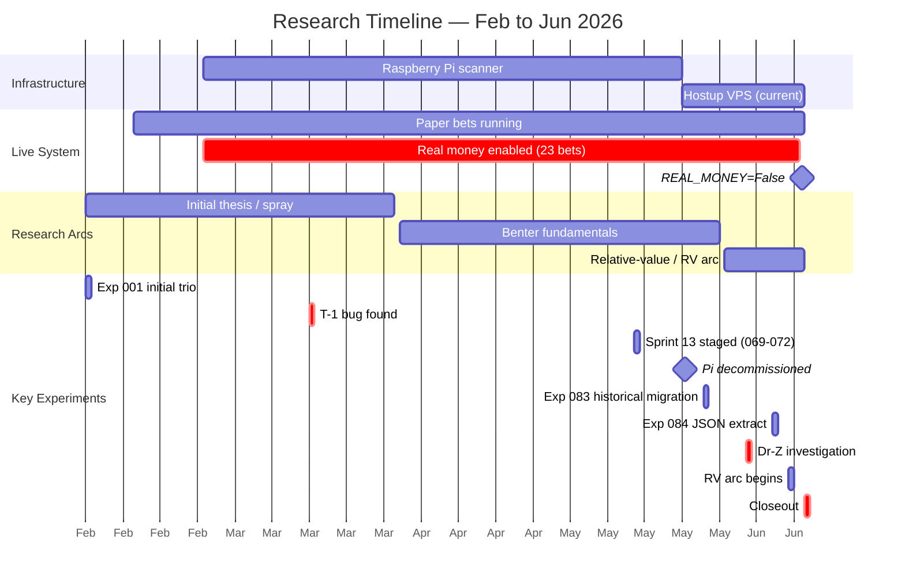
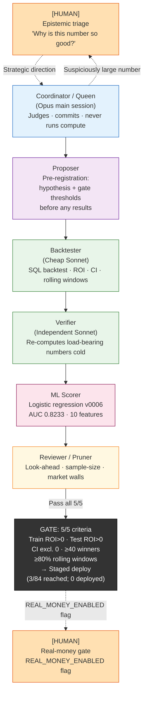
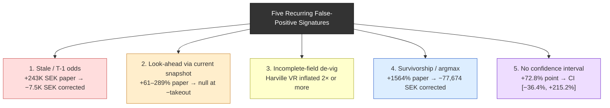

# Two Ways to Fool Yourself: A Series Introduction

The biggest number in this program was +650% paper ROI — a quarter-million Swedish kronor on paper. That number was wrong. The real figure, after diagnosing a stale-odds settlement bug, was −20%. The bug passed every automated gate, every pre-registered check, every independent verification step. A human noticed the number smelled wrong and asked why.

That is where the interesting part of this series lives. In four months running an AI-operated quant shop targeting the Swedish trotting tote, I racked up 84 experiments, 464,787 odds snapshots, 10,358 paper bets, and 23 real-money bets. The market beat me clean.

There are two ways to fool yourself in this game. The first is well-known: you overfit, you cherry-pick, you mistake noise for signal. The second is subtler: you build fast, the feedback loops tighten, and the deceptions become more elaborate before you catch them. The T-1 bug survived five automated quality checks because the multi-agent pipeline had no mechanism for asking "is this number physically plausible?" Only the human outside the loop had that. AI agents do not protect you from self-deception. They accelerate the iteration speed at which you can construct one.

This series tells both stories. The null result earns its credibility because the infrastructure was real enough to have caught a genuine edge, had one existed.

---

## The Thesis

The edge thesis was not invented. It was lifted from a four-decade-old literature. That academic pedigree made the null result more sobering, not less.

ATG, the Swedish pari-mutuel operator, runs merged pools across bet types — win, place, and most exotics share a single pool fed by Swedish, Norwegian, and international money. But some exotic pools (trio, komb, tvilling) remain thin and illiquid. Hypothesis: illiquidity creates mispricing recoverable using Harville-derived probability estimates.

The Harville (1973) model gives you a tractable way to compute the probability of any ordered finish from a set of win probabilities. Apply it to a thin trio pool, compare the implied combo probability to the market's implied probability, and you have a value ratio. Bet where the ratio clears the takeout.

Hausch, Ziemba, and Rubinstein (1981) showed this approach can generate genuine positive expected value near post time. Their result was demonstrated on North American thoroughbred place/show pools; the probability methodology transfers to Nordic trotting exotics even if the market structure differs.

The dream was a structural, model-based edge in under-bet exotic combinations. The market had other ideas.

---

## The Machinery

What got built to test this thesis is genuinely unusual.

<figure>

<figcaption>Timeline of the program from first paper bets (2026-02-10) through closeout (2026-06-16), with 84 experiment milestones (83 tracked in MLflow), live-money events, and the infrastructure migration from Raspberry Pi to VPS marked.</figcaption>
</figure>

A live scanner collected real-time odds from ATG's `api.travsport.se` endpoint, accumulating 464,787 snapshots between 2026-02-23 and 2026-06-16 — the one proprietary asset the program produced, unavailable publicly. The scanner started on a Raspberry Pi and migrated to a Hostup VPS on 2026-05-24.

Eighty-three experiments were tracked in MLflow (one early run predated the tracking setup), spanning early trio-strategy discovery, a Benter-style fundamentals model, Norwegian deep dives, cross-pool relative value, a Dr-Z place system, and a full efficiency-cascade audit. Three experiments (069, 071, 072) cleared a five-criteria promotion gate and were staged. None were deployed.

A Playwright betting engine on the Mac read pending bets from the VPS over HTTP and placed them through a Chromium profile, with BankID login pushed to Telegram as a QR code. It placed 23 real-money bets before being paused.

The promotion gate was mechanical and pre-registered:

- Train ROI > 0
- Test ROI > 0
- Bootstrap confidence interval excludes 0
- At least 40 test winners
- At least 80% of rolling windows profitable

An experiment that passed 5/5 criteria but missed its pre-registered primary CI threshold was correctly rejected. The gate was written before results were seen. That discipline killed p-hacking — or at least made it traceable.

---

## The Human's Job

The most clarifying question to ask about an AI-operated research program is: what did the human actually do?

Three things. Fund the VPS and the bankroll. Flip one flag — `REAL_MONEY_ENABLED = True` or `False`. And ask, with skepticism, "why is this number so good?"

That third role turned out to be the most important.

The single largest catch was the T-1 odds bug. Paper P/L appeared to be +243K SEK — a +650% paper ROI. The corrected figure, after diagnosing a stale-odds settlement error, was −7.5K SEK, a real P/L of roughly −20%. No automated test caught it. The gate passed it. The verifier passed it. The smell test caught it.

A structured AI loop — pre-registration, independent verifiers, mechanical gates — does not protect you from data-leakage bugs that produce 10× ROI illusions. The most valuable contribution was irreducibly human: pattern recognition and discomfort with a number.

---

## The Syndicate

The research was run through a hand-rolled multi-agent loop called the Syndicate, built before Claude Code had native workflows. A single `/syndicate` slash-command spun up a structured sprint.

**Clarification:** the Syndicate is a six-role loop, not six concurrent agents. Background tasks serialized in practice; staging to deploy was manual.

Six roles, in order:

1. **Coordinator / Queen** — an Opus main session that judges and commits verdicts. Never runs compute.
2. **Proposer** — writes the pre-registration before any results are seen.
3. **Backtester** — a cheap Sonnet agent that runs the SQL backtest.
4. **Verifier** — a second, independent Sonnet that re-computes load-bearing numbers from a cold brief.
5. **ML Scorer** — runs the logistic scorer (v0006: 10 features, AUC 0.8233) to produce ranked subsets.
6. **Reviewer / Pruner** — checks look-ahead contamination, sample-size adequacy, market-structure walls.

Opus coordinates, Sonnet computes — economically rational and epistemically useful. The coordinator that never runs backtests has no skin in the game for any particular result, which makes rejection easier.

<figure>

<figcaption>Flowchart of the Syndicate's six roles and two irreducible human roles, showing how coordination, compute, verification, and the real-money gate connected.</figcaption>
</figure>

The one structural improvement that genuinely held up: the independent AI verifier. A second agent re-running numbers from a cold brief catches arithmetic errors that a single-agent pipeline propagates silently. It is not sufficient to prevent look-ahead. It is sufficient to catch calculation bugs.

---

## Memory as Continuity

A Claude Code session is stateless. The coordinator that runs sprint 14 has no memory of sprint 1 unless you give it one.

The solution was a structured markdown store — files at `~/.claude/.../memory/`, indexed by `MEMORY.md`, with `feedback_`, `project_`, and `reference_` nodes. Every sprint's state and ruled-out hypotheses were written at session end; a fresh session rehydrated by reading the index first. The critical property: corrections persisted. After 15 stray overnight BankID QR codes hit Telegram, the quiet-hours rule was written to a feedback node. After the T-1 bug was diagnosed, stale-odds artifacts could never again be counted as results. The coordinator is stateless. The knowledge base is not.

---

## The Five Recurring Deceptions

Every promising result in 84 experiments turned out to be one of five recognizable illusions.

<figure>

<figcaption>Taxonomy of the five recurring false-positive signatures: name, appearance, diagnostic tell, and real program example with corrected figure.</figcaption>
</figure>

**Stale / T-1 odds.** Settling paper bets at a pre-close snapshot rather than the realized closing dividend. Win odds move 17% (median absolute) in the final 60 seconds across 1,569 settled horses (SE/NO/FR scanner data) — favourites shortening ~6%, longshots drifting ~20%. A system that captures longshots at T-60s and is paid the close shows massively inflated P/L.

**Look-ahead via current snapshots.** Using today's value of a quantity that updates over time to select historical bets. The Dr-Z place system appeared to produce ROIs of +61–289% across FR and NO markets — all caused by selecting on the realized place dividend. Tell: impossibly high strike rates (longshots "placing" 95%).

**Incomplete-field de-vig.** Normalizing win probabilities over a subset of starters inflates every probability in the subset. Inflated win probabilities produce inflated Harville probabilities, which produce spurious value ratios. The correction is mechanical: always de-vig over the complete starting field.

**Survivorship / overfitting.** The `historical_combos` table holds only pre-selected combos — roughly half of real races. Filter analysis on it is circular: you are searching for edges in a table built by the same strategy under test. The komb spray headline of +1564% paper ROI arose from a combination of this survivorship bias and high-variance longshot payouts; neither effect was replicable. Exp 111 full-universe verification returned −77,674 SEK on 89,915 SEK staked.

**No confidence interval.** Point estimates on small, high-variance samples are noise. Race-clustered bootstrap CIs erased every "edge" that survived the four checks above. The thin-pool regime showed a +72.8% point estimate at edge ≥ 0.10. The race-clustered CI: [−36.4%, +215.2%]. Statistically void.

All five appeared multiple times. The first four were catchable by pre-registration plus independent verification; the fifth required explicit CI computation. None were caught by automated tests — they were caught by the Reviewer, the Verifier, and the human smell test, in that order.

---

## The Verdict

The fundamentals model — Benter-style, trained on pedigree, equipment, driver statistics, and market-history features — achieved OOS Brier 0.081 against a market-close Brier of 0.072: approximately 13% worse than simply using closing odds as the probability estimate. (The 13% gap uses the full out-of-sample period, closing Brier 0.0721. A shorter Feb–mid-May evaluation window yields closing Brier 0.064 and a wider 26% gap; both are reported in Post 2.) Blending the model with closing odds improved Brier by roughly 0.15% — sub-takeout by a factor of 100.

The closing tote is the efficient equilibrium. On ATG win markets specifically, the standard favorite-longshot bias runs in reverse — strong favorites underbet, longshots overbet — consistent with the higher stakes field of Nordic racing. Every public-data angle tested here reached the same conclusion: the close is the sharpest predictor, and nothing built from public form data beats it by more than the 15–25% takeout.

Real-money tvilling was paused on 2026-06-15, the day before the formal closeout, when the winner-drift analysis showed winning tvilling combinations shorten ~11% into close — refuting the thin-pool mispricing thesis for that market specifically and triggering the pause decision. The corrected real-money record: 23 bets, 4 wins, ROI −12.4%.

The human flipped the flag off. That is what the flag is for.

---

## What This Series Covers

1. **The edge thesis** — why a four-decade-old result was worth testing on Nordic trotting, and what a clean null looks like.
2. **Tote mechanics primer** — how pari-mutuel odds form and why the close is efficient; the T-1 bug that turned +650% into −20%.
3. **The Benter fundamentals model** — why a Brier 0.081 model cannot beat a Brier 0.072 market, regardless of AUC.
4. **The Dr-Z place system** — three nested levels of look-ahead, each producing a genuine-looking edge.
5. **Thin-pool regime testing** — what race-clustered CIs do to +72% point estimates.
6. **The efficiency cascade** — how closing odds dominate across pool types, and why tvilling was paused.
7. **Postmortem** — market-efficiency synthesis and what was genuinely learned.

Two things were never delegated: the real-money gate and the smell test.

---

## References

Harville, D.A. (1973). Assigning Probabilities to the Outcomes of Multi-Entry Competitions. *Journal of the American Statistical Association*, 68(342), 312–316.

Hausch, D.B., Ziemba, W.T., and Rubinstein, M. (1981). Efficiency of the Market for Racetrack Betting. *Management Science*, 27(12), 1435–1452.

Benter, W. (1994). Computer-Based Horse Race Handicapping and Wagering Systems: A Report. In Hausch, D.B., Lo, V.S.Y., and Ziemba, W.T. (eds.), *Efficiency of Racetrack Betting Markets*. Academic Press.

Thaler, R.H. and Ziemba, W.T. (1988). Parimutuel Betting Markets: Racetracks and Lotteries. *Journal of Economic Perspectives*, 2(2), 161–174.

Snowberg, E. and Wolfers, J. (2010). Explaining the Favorite–Longshot Bias: Supply- and Demand-Based Explanations. *Journal of Political Economy*, 118(4), 742–758.
