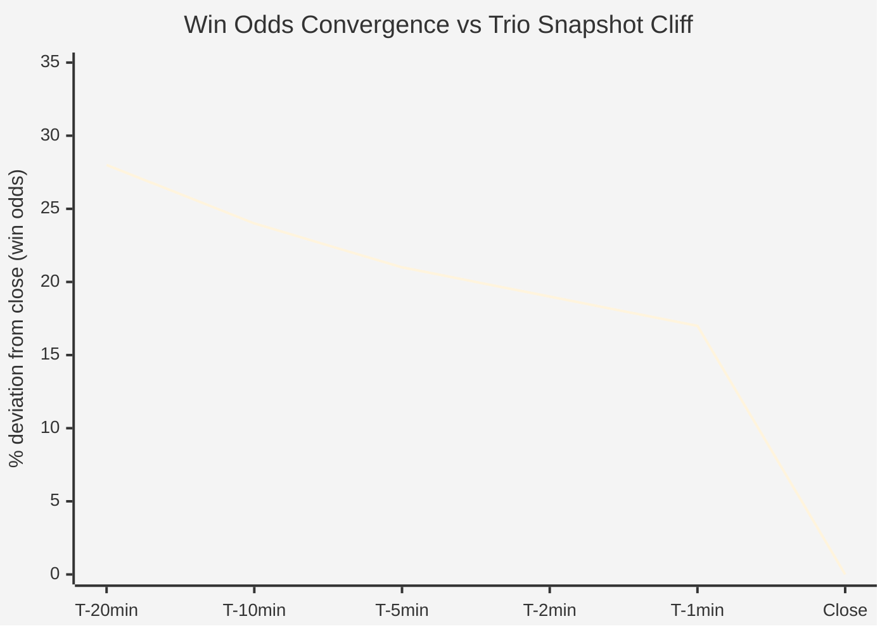

The paper P/L said +243,016 SEK. The real P/L was −7,496 SEK. Same bets. Same selections. Same database. The only thing that changed was which column we used to settle them.

That gap — +658% ROI versus −20% ROI on 7,112 bets — came from a single mechanical error in a data pipeline: settling paper bets at the last scanner snapshot rather than the realized closing dividend. It made every longshot exotic strategy look like it had found something real. A human reading a suspiciously large number caught it — not an automated test, not the pre-registration gate, not the independent verifier agent.

---

## What T-1 Odds Actually Are

The live scanner runs on a VPS. It polls the ATG API endpoint at roughly one-minute intervals and records the current odds for every active bet in every race on the card. When the betting window closes, the scanner records one final snapshot — call it T-1, meaning the last biddable price the system sees before post.

That snapshot is not the price you get paid.

In a pari-mutuel pool, as Thaler and Ziemba explained, late money changes every other bettor's effective price. You are never paid the odds that flashed on the screen when you placed your bet. You are paid the dividend computed from the total pool after all money — including money wagered off-track, via third-party co-mingling agreements, and via international feed streams — has been added. That final pool state is not available until after betting closes. The T-1 snapshot is, at best, a noisy forecast of the actual payout.

For most purposes the error is tolerable. Win odds at T-60 seconds run a median 17.2% off the eventual closing dividend across 1,569 horses in the scanner dataset — favourites shorten roughly 6%, longshots drift out roughly 20%. That is a meaningful gap for analytical purposes but it is at least the right order of magnitude. And as the collected studies in Hausch and Ziemba show, information continues entering the pool right up to the close; the snapshot is a lagged reading of a moving price, not a random noise term.

For trio and other exotic combos in thin Swedish pools, the situation is categorically different.

<figure>



<figcaption>Line chart comparing win odds convergence toward close (median % deviation at T-20min through T-60s) against the conceptual trio longshot cliff at close. Win odds arrive roughly 17% off at T-60s via a gradual drift; trio snapshot odds are approximately stable through the betting window, then step-cliff at close when off-track money lands.</figcaption>
</figure>

---

## The Cliff

A trio bet covers a specific combination of three horses finishing in exact order. In the SE/DK merged pool, the most common longshot trio combinations have almost no money on them during the open-betting window. A snapshot at T-60 seconds might show 1,500× or 6,000× or 10,000× (the scanner ceiling) because the existing pool stake for that combination is tiny — a few hundred kronor. After betting closes, even modest off-track money flooding into the final pool is a large multiple of that pre-close stake, so the finalized dividend collapses to a fraction of the snapshot.

The seven trio winners recorded after the T-1 bug was fixed illustrate the structure of this collapse. They are not a statistical sample — seven is too few for that — but they are enough to show the mechanism:

| Track | T-1 snapshot | ATG close | Drop to close |
|---|---|---|---|
| Klosterskogen | 1,575× | 877× | −44% |
| Åby | 2,157× | 917× | −57% |
| Östersund | 6,044× | 1,921× | −68% |
| Jarlsberg | 218× | 178× | −18% |
| Dannero | 10,000× | 614× | −94% |
| Bergsåker | 10,000× | 811× | −92% |
| Århus | 10,000× | 63× | −99.4% |

Jarlsberg is the closest to well-behaved — relatively low odds, probably a somewhat thicker pre-close pool. Århus is the extreme case: the scanner ceiling of 10,000× collapses to 63× at close. A 99.4% drop. The off-track money that arrived post-close was not a small rounding correction; it was a multiple of the entire existing pool for that combination.

<figure>
  
  <figcaption>Pair of dots per race — left dot the T-1 snapshot dividend, right dot the ATG realized closing dividend — connected by a line showing the collapse. Log-scaled range from 63× to 10,000×. Århus anchors the extreme right, with the longest drop line.</figcaption>
</figure>

The 50–99% range cited in the project record is the range of those seven examples, not a characterized distribution. The headline stands without precision claims: for longshot exotic combos in thin pari-mutuel pools, the pre-close snapshot is a systematically inflated reading of what will actually be paid. The collapse mechanism is structural, not behavioral — post-close off-track volume enters the pool as a single event after betting freezes, diluting the pre-close snapshot drastically. Snowberg and Wolfers documented that longshots are also systematically overbet in win pools by the crowd; in thin exotic pools the additional driver here is this post-close volume landing on a near-empty book.

---

## What the Bug Did to the Numbers

The live scanner was storing T-1 odds in a column called `t1_odds`. The backtesting queries were joining to this column as the settlement price. There was a separate `final_odds` column populated later from ATG's finalized dividend feed, but early backtest queries either ignored it or didn't yet exist when the column was empty for recent races.

A simplified version of the settlement logic that produced the inflated figures looked like this:

```sql
-- Buggy: settles at last scanner snapshot
SELECT
    b.race_id,
    b.combo_key,
    b.stake,
    b.t1_odds,
    CASE
        WHEN b.combo_key = r.winning_combo THEN b.stake * b.t1_odds
        ELSE 0
    END AS payout
FROM paper_bets b
JOIN race_results r ON b.race_id = r.race_id
```

The corrected version insists on the finalized dividend:

```sql
-- Correct: settles at ATG finalized closing dividend
SELECT
    b.race_id,
    b.combo_key,
    b.stake,
    b.final_odds AS settlement_odds,  -- explicit: never fall back to t1_odds
    CASE
        WHEN b.combo_key = r.winning_combo
        THEN b.stake * b.final_odds
        ELSE 0
    END AS payout
FROM paper_bets b
JOIN race_results r ON b.race_id = r.race_id
WHERE b.final_odds IS NOT NULL  -- sentinel: exclude races pending dividend back-fill
```

The `WHERE b.final_odds IS NOT NULL` filter is the load-bearing line. NULL rows are races where the finalized dividend has not yet been written back — omitting them without the filter would silently pass through T-1 settlement for any race where the back-fill had not run. Treat them as zero-payout and you undercount wins; exclude them and you get a clean analysis over confirmed settlements only. The original queries had neither the correct column nor the sentinel. Every winning trio bet settled at a snapshot that was 44–99% too high.

---

## The Corrected Figures

The inflated paper backtest ROIs for the spray strategies were +4,831% for SE/DK komb (79 winners across 37,095 bets over 72 months) and +3,551% for SE/DK trio (24 winners across 28,132 bets). These are what the bug produced. They are the Before column in the chart below.

After correcting settlement to `final_odds` throughout the pipeline, the overall paper system went from +243,016 SEK (+658% ROI) to −7,496 SEK (−20% ROI) on the same 7,112 bets with 12 winners.

<figure>
  
  <figcaption>Grouped bar chart comparing T-1 snapshot settlement (buggy, red) vs. ATG realized closing dividend settlement (corrected, green) for the main strategy results. Zero line prominently marked; only the buggy bars cross it.</figcaption>
</figure>

For the tvilling real-money record, which used actual ATG settlement from the start because real bets settle at the true dividend automatically, the correction was about filling in NULL `final_odds` winners that had been backfilled late. The honest record: 23 bets, 4 wins, ROI −12.4%.

The full komb universe is not profitable. The Experiment 111 verification on 2,694 bets under strict final-odds convention: −77,674 SEK on 89,915 SEK staked. The earlier signals require separating causes. The +1,564% backtest ROI (komb spray, full historical sample) was primarily a T-1 settlement artifact. The +1,135% live ROI figure came from a survivorship-biased filtered slice — the "valid final_odds, stake ≤ 200 SEK" subset representing roughly 18% of komb bets — compounded by argmax selection on that filtered group. The full 2,694-bet universe was negative regardless of the settlement column.

Note that T-1 odds for komb and tvilling (two-horse combinations, slightly thicker pools) are typically smaller in practice than for trio — the snapshot-to-close gap tends to be narrower in those pool types (observed komb drift ranges from 1.03× to 1.22× median across samples). But "relatively stable" is not the same as "accurate settlement price," and the corrected figures confirm that even komb is negative across the full universe.

---

## How It Was Caught

Here is the uncomfortable part of the operational story: none of the designed safeguards caught this.

The pre-registration gate requires writing a hypothesis, primary metric, and CI threshold before results are seen. It caught what it was designed to catch — in Sprint 14, for example, a log-PPC idea formally passed 5 of 5 checklist items but missed its pre-registered primary CI threshold (ci_lower = 31.15% against a gate of > 33.67%) and was correctly killed. The gate is a real defense against p-hacking and goalpost-moving. It is not a defense against using the wrong settlement column, because that error is upstream of the backtest, in the data pipeline's own assumptions. The pre-registration document never mentioned which column to settle on, so the gate had nothing to check.

The independent verifier design — a second Sonnet agent recomputing load-bearing numbers cold from a self-contained brief — is intended to catch calculation errors and context-slip. But the verifier was given the same brief as the backtester, which specified the same data pipeline with the same settlement column. Independent computation on a flawed specification produces independently wrong answers that agree with each other.

What actually caught the T-1 bug was a human reading a number.

It happened during a routine review of the paper system results: +658% ROI across 72 months of bets in a 15–25% takeout market. The academic literature going back to Hausch, Ziemba, and Rubinstein in 1981 has documented only small, pool-specific inefficiencies that barely survive takeout when they survive at all. A four-digit return from a spray strategy on public data — no private signals, no speed advantage, no rebate arrangement — is not a plausible number. The thought was: something must be wrong with the measurement, not the market.

That suspicion triggered a manual audit of the settlement logic, which found the wrong column, which found the missing sentinel filter, which led to the `final_odds` back-fill and the complete restatement of paper P/L. No automated process initiated it. The pre-registration gate, the verifier agent, the CI thresholds — all of them were downstream of the bug and had no view into it.

---

## The Verifier Brief Problem

After the T-1 bug was fixed, the project added explicit settlement-column discipline to every subsequent backtest brief. But the T-1 episode surfaced a deeper structural issue with the verifier design: a verifier agent running independently is only as good as the brief it receives.

Background Sonnet agents have zero conversation context from the main session. They receive a self-contained document and return a result. If that document omits a DB path, specifies the wrong table, leaves a sentinel filter undefined, or contains an implicit assumption about which column means what, the verifier produces a plausible-looking answer to a subtly different question.

The verifier brief template that emerged from this episode specifies, for every numerical result:

```
# Verifier brief: required fields

1. Hardcoded absolute VPS paths to the relevant database and table
2. Explicit definition of what constitutes a valid row
   (e.g., final_odds IS NOT NULL AND final_odds > 0)
3. The exact formula for the metric being reproduced
4. A sanity-check expectation
   (e.g., "the count of valid rows should be approximately 2,694;
    if you see more than 3,000, something in the filter is wrong")
5. The column to use for settlement, named explicitly, not inherited
   from a pipeline variable
```

A verifier brief that is not self-contained is not a verifier. It is a second agent computing an answer to a question that may not be the question you meant to ask. Every agent in the pipeline must know exactly which price it is settling against and must reject ambiguous rows rather than default to anything that will produce a number.

---

## The General Lesson

In thin exotic pools, the T-1 snapshot for a longshot trio combo is not a price — it is what the dividend would be if betting closed this second with zero additional volume. The actual post-close dividend reflects a global pool that may be fifty times larger, with all the informed off-track money included. Settle at the realized closing dividend, always.

For the win pool specifically, closing prices are demonstrably sharper — Brier 0.06572 at T-60s vs. 0.06434 at close — and fading the late move produces negative ROI (approximately −45% on a directional 374-race sample; treat as directional, not a precise figure). For trio exotic combos, the collapse is not about information but about volume: post-close off-track money mechanically dilutes payouts regardless of whether prices were informationally accurate before close. Two distinct mechanisms, same operational rule: use the closing dividend.

The numbers that led to this discovery should have been disqualifying on their face. A +4,831% backtest ROI for a spray strategy in a 15–25% takeout market is not a signal — it is a measurement error. An honest pari-mutuel market that has absorbed decades of academic attention since Hausch, Ziemba, and Rubinstein does not yield four-digit returns to a public-data strategy. When a metric is orders of magnitude larger than theory would predict, audit the measurement first.

---

## Takeaways

**Settle at the realized closing dividend.** In pari-mutuel, the T-1 snapshot is a systematically inflated forecast for exactly the combos you want to bet — longshot exotics in thin pools — because off-track money collapses those dividends by 50–99% after betting closes.

**Numbers that look impossibly good are almost always wrong.** A +658% paper ROI in a 15–25% takeout market is a measurement bug, not an edge. Audit the settlement column before investigating anything else.

**Pre-registration guards against p-hacking; it does not guard against upstream data bugs.** The gate caught what it was designed to catch. The T-1 bug lived upstream of anything the gate could see.

**Verifier agents require fully self-contained briefs.** A verifier computing the right formula on the wrong column produces a confident wrong answer. Hardcode the settlement column, the sentinel filter, and a sanity-check row count in every brief.

---

## References

Benter, W. (1994). Computer-based horse race handicapping and wagering systems: a report. In Hausch, D.B., Lo, V., and Ziemba, W.T. (eds.), *Efficiency of Racetrack Betting Markets*. Academic Press.

Hausch, D.B., and Ziemba, W.T. (eds.) (1994). *Efficiency of Racetrack Betting Markets*. Academic Press (reissued World Scientific, 2008).

Hausch, D.B., Ziemba, W.T., and Rubinstein, M. (1981). Efficiency of the market for racetrack betting. *Management Science*, 27(12), 1435–1452.

Snowberg, E., and Wolfers, J. (2010). Explaining the favorite–longshot bias: supply- and demand-based explanations. *Journal of Political Economy*, 118(4), 517–558.

Thaler, R.H., and Ziemba, W.T. (1988). Parimutuel betting markets: racetracks and lotteries. *Journal of Economic Perspectives*, 2(2), 161–174.
