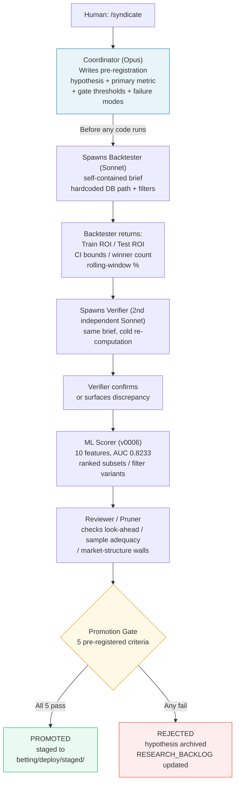

Here is the number: +98% test ROI, all five checklist criteria green, the bootstrap CI lower bound positive. Sprint 14 of the Syndicate returned that result on a logistic scorer variant I called v0007. A researcher sitting in front of those numbers would feel a strong pull to call it a win.

The system rejected it. The pre-registered threshold was 33.67% for the CI lower bound. The actual CI lower bound was 31.15%. Two and a half percentage points below a number that was written down before the backtester ran.

That rejection is the system working. The rest of this post is about why the system needed to exist at all, how it was built, what it got right, and where it was janky.

---

## The Problem It Was Built to Solve

As Simmons, Nelson, and Simonsohn showed in a widely-cited 2011 study, researchers can present almost anything as significant if they have enough undisclosed flexibility in how they choose their analyses (Simmons et al., 2011). The particular flexibility in quantitative betting research is brutal in its simplicity: run enough backtests until one passes, then write the hypothesis to match. You do not even need to be dishonest about it. You run "pool-size filter," it fails. You run "pool-size filter with field-size constraint," it fails. You run "pool-size filter with field-size constraint and driver substitution," it passes — and you write that down as your hypothesis. Post-hoc by construction, but it reads like prediction.

Parimutuel markets make this worse. As Hausch, Ziemba, and Rubinstein showed, win pools are roughly efficient while place and show markets can contain genuine mispricings (Hausch et al., 1981) — and as Thaler and Ziemba surveyed, those anomalies are slippery in practice (Thaler and Ziemba, 1988). A real edge is achievable at scale, as Benter documented, but it requires rigor that informal backtesting cannot provide (Benter, 1994).

The Syndicate was built to impose that rigor mechanically, before any results are seen.

---

## The Pre-Registration Document

The first thing the Syndicate does in any sprint is write down the bet. Not the bet on a horse — the bet on the research outcome. Before the backtester runs, the Coordinator writes a pre-registration document specifying the exact hypothesis, the primary metric, the gate thresholds, and the explicit failure modes under which the result is uninterpretable regardless of headline ROI.

This document is written cold. The Coordinator has not run any code, has not queried the database, has not seen an indicative ROI number. The threshold is set by asking what the previously promoted experiments cleared, then requiring the new idea to meet the same bar. At Sprint 14, the pre-registered primary threshold was 33.67% for the CI lower bound — the minimum ci_lower cleared by any previously promoted experiment, specifically Exp 071, the weakest of the three promoted results. That number was on paper before the backtester touched the data.

Once the document exists and is committed to the sprint workspace, the threshold is fixed. If the CI lower bound comes in at 31.15% and the threshold says 33.67%, there is no discussion. It fails.

---

## The Promotion Gate and Three Experiments That Cleared It

The five-item scorecard, all pre-registered:

1. **Train ROI > 0** — positive return in the training period. A negative training ROI is a strong prior against any out-of-sample result.
2. **Test ROI > 0** — positive return in the held-out test period (the final 20% of races by date). Train-only positive is an overfit.
3. **Bootstrap CI excludes 0** — a race-clustered bootstrap on the test-period bets must produce a 95% CI with a lower bound above zero. This is where most ideas died.
4. **At least 40 test winners** — the CI computation requires sufficient sample to be meaningful on skewed payout distributions. A CI on 7 trio wins is not informative.
5. **At least 80% of rolling windows profitable** — the strategy must show stable profitability across time, not a single lucky run.

All five must pass. Four out of five is still a fail. There is no partial credit, no "promising directional result," no "would have passed with more data." The gate is mechanical and the pre-registration makes it immovable.

Three experiments cleared this gate across the whole program:

| Experiment | Description | Test ROI | CI Lower | Test Winners | Status |
|---|---|---|---|---|---|
| 069 | Pool ceiling 2.5M SEK, NO+FR trio, VR≥3.0 | +142.1% | +62.8% | 189 | Staged, not deployed |
| 071 | Relaxed filter + ML v0006, NO/FR/AU trio, VR=4.0 | +97.77% | +33.67% | 45 | Staged, not deployed |
| 072 | Strict filter + ML v0006, NO/FR/AU trio, VR=4.0 | +205.75% | +71.50% | 40 | Staged, not deployed |

<figure>
  
  <figcaption>Experiments 069, 071, and 072 all cleared the promotion gate. All three were staged to betting/deploy/staged/ and never deployed to live betting. The CI lower bounds tell you exactly why each passed; the status line tells you the staging-to-deployment gap the postmortem names as jank.</figcaption>
</figure>

All three were staged. None were deployed. The Syndicate solved the research-quality problem. It did not solve the deployment-confidence problem.

---

## Six Roles and What They Actually Did

The Syndicate is a SKILL.md prompt template invoked by `/syndicate`. The Coordinator — an Opus main session — reads the template, creates a timestamped sprint workspace, and orchestrates six functions:

- **Coordinator / Queen (Opus)** — triage, write briefs, judge, commit. The only role touching the pre-registration and the final verdict. Never runs code directly.
- **Proposer** — writes the pre-registration before results are seen. In practice this was the Coordinator itself, acting first in each sprint.
- **Backtester (Sonnet)** — receives a self-contained brief (DB path hardcoded, filters explicit) and returns ROI, CI, winner count, rolling-window stability. The brief had to be fully self-contained because background Sonnet agents have zero conversation context from the main session. Ambiguity produced silent wrong results.
- **Verifier (a second independent Sonnet)** — re-computes load-bearing numbers cold from the same brief. The Coordinator never trusts one agent's arithmetic, and the verifier brief is separate so the verifier cannot inherit a framing error from the first agent.
- **ML Scorer** — runs the logistic scorer (v0006: 10 features, AUC 0.8233). In Sprint 14 this meant training v0007 with the log_ppc feature, comparing AUC to baseline, and finding AUC unchanged at 0.8233 — confirming the feature added no discriminative power.
- **Reviewer / Pruner** — checks structural failure modes before the gate runs: look-ahead contamination, sample-size adequacy, market-structure walls.

The Coordinator used Claude Code's Task tool to spawn background Sonnet agents with self-contained briefs. Agents returned text; the Coordinator reconciled results and applied the gate. A claude-flow CLI swarm layer was bolted on via Bash, though in practice it added ceremony more than it changed execution.

The "Opus coordinates / Sonnet computes" cost discipline was explicit: judgment in the expensive-but-sparse tier, compute parallelized in the cheap tier. Over ~84 experiments through the Sprint 14 closeout in March 2026, this compounds.

<figure>



<figcaption>The Syndicate pipeline from /syndicate invocation to promoted/rejected verdict, showing all six roles and the promotion gate. Sprint 14's log-PPC idea traces the path from pre-registration through backtest and verification to the CI lower bound check, where the pre-registered threshold stops it.</figcaption>
</figure>

---

## Sprint 14: The Gate Working as Designed

Sprint 14 ran on 2026-03-22, the last sprint before the project's closeout phase. Two ideas were on the table.

The first was the AU-specific ML idea: could the logistic scorer that worked on Norwegian and French pools generalize to Australian races filtered to field sizes 8–12 and a pool-per-combo floor of 1700 SEK? Clean 0/5. Three test winners from 413 test bets. Train ROI -38.41%, test ROI -28.63%. AU as an explicit research target was closed permanently.

The second was the log-PPC idea: add log(pool_per_combo) as an eleventh feature to the logistic scorer (creating v0007), with the hypothesis that this continuous ppc signal would allow the model to discriminate genuine structural mispricings from liquidity-inflated VR readings. The pre-registered primary: v0007's CI lower bound must exceed Exp 071's 33.67% threshold.

Sitting in front of the output, the pull is immediate:

```
v0007 backtest results
  Training ROI:    +37.70%    PASS
  Test ROI:        +98.00%    PASS
  Test winners:    45         PASS
  Bootstrap CI:    [31.15%, 177.71%]
  CI lower bound:  31.15%     < 33.67% threshold   FAIL
  Rolling windows: 100%       PASS

  Checklist items: 5/5 met
  Pre-reg primary: FAIL (31.15% < 33.67%)
```

Five of five checklist items passed. The pre-registered primary threshold failed by 2.52 percentage points.

Without the pre-registration, a researcher would feel the sequence Simmons et al. described: the threshold migrates to wherever the number landed. The CI lower bound is positive — only 2.5 points below threshold, and you could argue the threshold should have been 30% anyway. Because the threshold was written before the backtester ran, there is no migration. The sprint report says: "Hypothesis is rejected. Pre-registered primary NOT MET: ci_lower = 31.15% < 33.67% target."

The sprint also surfaced a useful negative: the log_ppc coefficient came in at -0.0038, effectively zero. AUC was unchanged at 0.8233 — identical to v0006. The ppc signal was already fully captured by existing features (log field size encodes the denominator of ppc, the pool filter constrains the numerator, market probability encodes pool concentration). The logistic regression correctly learned to ignore it.

The incidental positive: v0007's result was functionally identical to Exp 071 — same 45 winners, nearly identical ROI and CI. A redundant feature added to the model does not destabilize it.

---

## The Structural CI Bottleneck

Sprint 14 was clean. But many earlier sprints produced a more frustrating pattern: ideas that cleared the CI-excludes-zero criterion but had too few test winners to generate a meaningful interval.

NO and FR non-merged trio pools are thin. A typical filter on those markets produces 5 to 7 test winners. At 7 winners on a skewed payout distribution — trio payouts ranging from 100 SEK to several thousand SEK — the CI lower bound is strongly negative and the upper bound runs into the hundreds of percent. The interval is too wide to be informative.

The 40-winner floor exists because a CI on skewed payouts needs adequate sample before it conveys real information. But the floor killed directionally positive ideas through data sparsity, not genuine nulls. Sprint 11 illustrated this: strict filter plus ML at VR=6.0 returned +141.8% test ROI with 100% rolling windows profitable and 18 test winners. Three of five criteria passed. The gate failed at criterion 4. Sprint 12 lowered the threshold to VR=4.0. That is what produced Exp 071.

The gate is right and watching it kill plausible ideas through thin data is genuinely uncomfortable — both can be true in the same sentence. The design tension is real and the fix — include AU data to expand the universe — was identified but not completed before closeout.

<figure>
  
  <figcaption>A two-axis grid showing the relationship between test winner count and CI outcome. The structural bottleneck zone — directionally positive ROI, CI excludes zero, but fewer than 40 winners — is the region that killed ideas through data sparsity. The NO+FR regime consistently landed in that zone; adding AU data moved the winner count out of it.</figcaption>
</figure>

---

## What Was Janky (the Honest Account)

Four months, 14 sprints, ~84 experiments through the Sprint 14 closeout, and 23 real-money bets before the edge came into doubt. The promotional version stops there. The honest version adds:

**Background agents serialized in practice despite the config.** The Task tool spawning behavior produced sequential execution, not concurrent execution. "Six parallel agents" was an orchestration intent, not a wall-clock description. The system still worked — the results arrived, the gate ran, the sprint completed — but the throughput claim requires a footnote.

**"Six agents" was a soft count.** Depending on whether ML scoring was a separate Task call or folded into the backtester brief, the sprint used 4 to 7 agents. The six-role description is accurate as a taxonomy of functions; it is not a precise agent headcount.

**The staging-to-deployment gap.** Experiments 069, 071, and 072 all cleared the promotion gate and were staged to `betting/deploy/staged/`. None were ever deployed to live betting. The Syndicate solved the research-quality problem. It did not solve the deployment-confidence problem: passing a backtest gate is not the same as having enough live-forward conviction to commit real capital. The three promoted experiments sat staged until the project closed.

**Verifier brief fragility.** Briefs had to hardcode database paths and filter definitions — background agents have zero conversation context. A drifted path or a filter inconsistency between the backtester brief and the verifier brief produced silent wrong results that looked plausible. Catching these required the Coordinator to manually sanity-check verifier output against backtester output.

---

## The One Failure Mode the Gate Cannot Catch

The gate handles arithmetic errors (the verifier catches these), multiple testing (the pre-registration prevents post-hoc threshold adjustment), sample adequacy (the 40-winner floor enforces it), and temporal overfitting (the rolling-window criterion requires stability). It handles most of the common failure modes in systematic quantitative research.

It does not handle subtle data-leakage and look-ahead contamination.

Every instance of look-ahead contamination in this project produced results that passed every automated check. The Dr-Z investigation used a realized place dividend as a selection price — the ratio that proved contamination was 1.000 exactly, because the selection oracle was the outcome itself. BLUP scores baked in future races for young horses. Both were genuine backtest data-leakage errors the automated pipeline could not detect: backtester returned valid Python, verifier confirmed the numbers, checklist items showed green.

A separate failure surface was the live paper-betting P/L tracker, which settled results using a pre-close odds snapshot instead of the ATG final pool odds. Not a backtest contamination — it never entered the research pipeline — but it inflated reported paper P/L to +650% of what honest settlement showed. The fix was a data-provenance rule added to MEMORY.md: settle at the ATG final pool odds (closing), never a pre-close snapshot.

What caught all of these was the same mechanism: human skepticism about a suspiciously good number. "Why is this number so good?" is not a statistical test. It is a pattern-recognition question. The live P/L bug surfaced because a paper return of +243,000 SEK attracted scrutiny that -7,500 SEK would not have. The Dr-Z look-ahead surfaced because a 95% place-rate for 15-to-1 longshots is impossible on its face.

The asymmetry is the lesson: the gate handles the easy failure modes; human pattern recognition handles the hard one. The specific failure mode that looks most like a genuine edge is the one no automated verifier catches. The more extraordinary the result, the more suspicious you should be of the data configuration.

---

## Memory as Continuity

The Coordinator is stateless across sprints. A new session does not remember Sprint 10. What it does have is a structured markdown memory store at `~/.claude/.../memory/`, indexed by MEMORY.md, with nodes for sprint verdicts, ruled-out hypotheses, data-provenance lessons, and correction rules added after failures. A fresh session reads MEMORY.md and continues.

Rehydration in practice: the Coordinator reads entries like "Exp 082 drift cross-signal — closed null, Exp 106 retest failed to replicate" and "Dr-Z place system — closed null, look-ahead via rv_plats.plats_final_odds." Those nodes compress weeks of sprint history into the prior that shapes the next pre-registration. Without this layer, 14 sprints across 4 months would not be a research program; they would be 14 disconnected chats.

---

## The Lesson Worth Keeping

The trotting market lesson and the AI-ops lesson are the same lesson at different scales: raising the cost of self-deception does not eliminate self-deception.

The log-PPC idea passed five of five checklist criteria and was correctly rejected because the threshold was written before the backtester ran. Without that threshold, it would have been a pass. The independent AI verifier closed the common failure modes — arithmetic errors, framing drift — but did not and could not close look-ahead contamination. That one required a human noticing that a 95% place-rate for longshots is impossible.

The Syndicate answered the research question cleanly. The deployment question — 069, 071, and 072 sat staged until the project closed — is the part that remains open. Passing the gate is necessary. It is not sufficient. The honest account of any pre-registration system probably ends there.

---

## References

Benter, W. (1994). Computer-based horse race handicapping and wagering systems: a report. In D.B. Hausch, V.S.Y. Lo, and W.T. Ziemba (Eds.), *Efficiency of Racetrack Betting Markets*. Academic Press.

Hausch, D.B., Ziemba, W.T., and Rubinstein, M. (1981). Efficiency of the market for racetrack betting. *Management Science*, 27(12), 1435–1452.

Simmons, J.P., Nelson, L.D., and Simonsohn, U. (2011). False-positive psychology: Undisclosed flexibility in data collection and analysis allows presenting anything as significant. *Psychological Science*, 22(11), 1359–1366.

Thaler, R.H. and Ziemba, W.T. (1988). Parimutuel betting markets: Racetracks and lotteries. *Journal of Economic Perspectives*, 2(2), 161–174.
