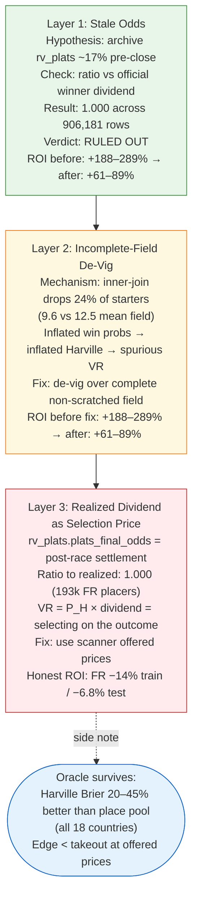
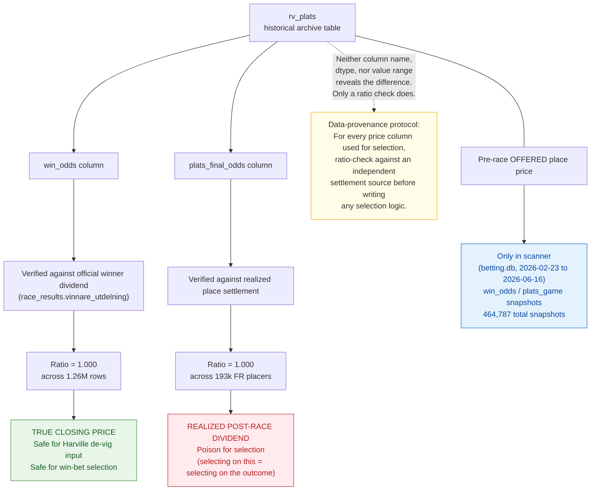

A 15-to-1 longshot was placing 95% of the time. Not occasionally. In selection after selection, across France, Norway, the US. That number is not a betting edge — it is a physical impossibility, and tracking it to its source took three layers of excavation.

The Dr-Z place-betting system showed +61% to +289% ROI in early runs, and every last basis point was a data artifact. This is the story of that investigation. It runs three layers deep. Each layer looked, briefly, like the full explanation. Only the third was the actual look-ahead. The reason that matters is not methodological tidiness: each layer produced a different number and a different conclusion, and if the work had stopped at layer two — as most informal postmortems do — the lesson drawn would have been wrong.

---

## The Premise That Is Actually Correct

Start with what is true, because it is genuinely interesting.

As Hausch, Ziemba, and Rubinstein first showed in their 1981 Management Science paper, win-pool prices contain more information about a horse's true finishing probability than place-pool prices do. The win pool is deeper, more traded, and more efficiently arbitraged. The place pool is shallower and draws less sophisticated action. The consequence: the place pool can systematically underestimate the finishing probability of a horse whose win probability is already accurately priced — creating an overlay exploitable by anyone who can compute the correct finishing probability from the win side.

The mechanism is Harville's formula (Harville, 1973). Given win probabilities $p_1, \ldots, p_n$ for $n$ horses, the probability that horse $i$ finishes second given horse $j$ finished first is $p_i / (1 - p_j)$. The general top-$k$ probability proceeds by iteratively removing the first-place finisher from the field. The Dr-Z system computes this Harville estimate — $P_{H}(top_k, i)$ — and compares it to the place pool's implied probability, $1 / \text{(offered place odds)}$. The value ratio VR is their product; bet when VR $\geq$ 1.0, settle at the closing place dividend.

We tested whether the Harville premise holds on ATG's archive spanning 18 countries. Win-pool Brier score outperforms place-pool Brier score as a predictor of place outcomes by 15–23% across that 18-country dataset. The oracle is real. The win pool, via Harville, is a sharper predictor of finishing position than the place pool itself — documented in Hausch and Ziemba's collected volume and confirmed here on Swedish and international data.

This fact survives everything that follows. The oracle works. The question is whether we were actually consulting it.

---

## The Three Layers

The investigation found three artifacts stacked on top of each other. They are worth narrating in sequence because each one taught a different lesson, and because the sequence itself is the point: if you peel one artifact and see a positive ROI, you stop too early.

**Layer 1: Stale odds.** The first hypothesis was that the archive win odds in `rv_plats` were pre-close snapshots — stale readings taken at T-60 seconds or earlier, not the true closing price. We already knew from the T-1 bug post that T-60s odds are a median 17% off the closing dividend. If the win odds used in Harville were inflated relative to the true close, every probability estimate would be off, and the VR selections would be partly spurious.

We tested this directly: ratio of `rv_plats.win_odds` to the official winner dividend from `race_results`, across 906,181 winner rows spanning 2020–2026.

The ratio was 1.000. Not approximately 1.000. Exactly 1.000.

The archive win odds are the true closing price. Layer 1 was explicitly retracted as a hypothesis. Ruling it out changed nothing about the ROI — it was only a diagnostic test. The headline figure was still +188% to +289%. Something else was doing the work.

**Layer 2: Incomplete-field de-vig.** The backtesting query joined `rv_plats` to the race records on horse ID and race ID. That inner join silently dropped horses that appeared in the odds archive but not in `rv_plats` — scratched runners, late withdrawals, entries for which place data was missing.

Mean starters per race in the inner-join universe: 9.6, against 12.5 in the full field. The join dropped roughly 24% of starters per race on average.

Normalizing win probabilities over a subset of the field inflates every probability in that subset, because they must sum to 1.0 and there are fewer of them. Inflated win probabilities produce inflated Harville $P(top_k)$ estimates. Inflated Harville estimates produce spurious VR $\geq$ 1.0 signals. You are manufacturing an overlay that does not exist.

The correct approach is to de-vig over the complete non-scratched field, then restrict to bettable horses for selection. The bug had these steps reversed.

Fixing the de-vig dropped the headline ROI. After correcting the field normalization across the full archive, ROI came in at +61% FR, +65% NO, +89% US. Still positive. Still plausible-sounding.

Fixing a real bug and seeing the numbers drop partway felt like progress. It was progress. But +61% is still +61%, still positive, still completely wrong.

<figure>



<figcaption>Three-layer artifact stack showing headline ROI at each stage of the investigation: from +188%/+289% (de-vig bug + look-ahead) through +61%–+89% (look-ahead only) to −14%/−6.8% (honest result on scanner prices). Each layer is labeled with the artifact name, the mechanism, and whether it was ruled out or confirmed.</figcaption>
</figure>

---

## The Smoking Gun

After correcting the de-vig bug, the remaining +61% to +89% result looked like it might be real. The oracle premise was confirmed. The win odds were verified as true closing prices. The field normalization was fixed. What could be left?

The answer required a different kind of question: not "is the ROI positive" but "what does the selected subset actually look like?"

The verifier agent was given a specific brief: check place-rate per win-odds bucket in the VR-selected subset and compare it to the bettable universe. That instruction was written into the brief, not left to agent judgment.

The bettable universe in France shows sensible place rates. Horses with win odds above 15 (longshots) place about 12.8% of the time — first or second out of a field. Horses in the 8–15 bucket place about 34.2%. These numbers are physically coherent with the well-documented favorite-longshot bias: longshots underperform their raw odds-implied probability even further in exotic pools (Snowberg and Wolfers, 2010).

<figure>
  <div class="placeholder">📊 Chart: Place-rate anomaly table: FR bettable universe vs. VR&gt;=1.0 selected subset, by win-odds bucket · render with matplotlib code in <code>blog/series/_specs/05-drz-look-ahead-postmortem.specs.md</code></div>
  <figcaption>Place-rate anomaly table: FR bettable universe vs. VR>=1.0 selected subset, by win-odds bucket. 15+ longshots place at 12.8% in the universe and 95.0% in the VR-selected subset. The 8-15 bucket places at 34.2% in the universe and 96.0% in the selected subset. The impossible gap is the definitive proof of look-ahead.</figcaption>
</figure>

Now look at the VR $\geq$ 1.0 selected subset. The 15+ longshot bucket places at 95%. The 8–15 bucket places at 96%.

A 95% place rate for a horse whose win odds are above 15 is not an impressive selection record. It is a physical impossibility. The only mechanism that produces a 95% place rate for genuine 15-to-1 longshots is one that can only pick them when they have already placed. The selection variable must be encoding the outcome.

The selection variable is `rv_plats.plats_final_odds` — the column used to compute VR as $P_H(top_k) \times \text{place\_odds}$.

A ratio check on 193,000 FR placer rows confirmed it: `plats_final_odds` matches the realized post-race place dividend at ratio 1.000. It is not a pre-race offered price. It is the settlement figure — what the pool paid out after the race. It is present in the archive because it is useful for settlement accounting, for P/L tracking, for checking the historical value of bets placed.

It is poison for selection. The settlement price and the selection price are two different things, and conflating them is the most seductive form of look-ahead contamination available to a researcher, because the column looks identical in a dataframe whether it was recorded pre-race or post-race (Thaler and Ziemba, 1988).

The Dr-Z VR formula with `plats_final_odds` reduces to:

```text
# KEY FINDING
VR = P_Harville(top_k) * (post_race_dividend)
```

VR $\geq$ 1.0 is equivalent to selecting horses where the Harville probability times the actual payout exceeds 1. This is always true for placers with favorable dividends. You are not predicting which horses will place — you are filtering to the ones that already did.

The +61% to +89% result was entirely this. Not partially. Not mostly. Entirely.

---

## The Column Map

The `rv_plats` table has two price columns that look identical in a dataframe — both numeric floats, similar range, similar naming convention. The distinction is not visible in the schema.

<figure>



<figcaption>Mermaid diagram showing the rv_plats archive table with two branches: win_odds (verified true closing at ratio 1.000 across 1.26M rows — safe for selection) and plats_final_odds (verified realized post-race settlement at ratio 1.000 across 193k FR placers — poison for selection). Pre-race offered place prices exist only in the scanner data from Feb–Jun 2026.</figcaption>
</figure>

- `win_odds`: verified true closing odds. Ratio to official winner dividend = 1.000 across 906,181 winner rows and 1.26M `rv_plats` rows. Safe for Harville de-vig input. Safe for selection-price use in win betting.

- `plats_final_odds`: verified realized post-race place dividend. Ratio to actual settlement = 1.000 across 193,000 FR placer rows. Fine for settlement accounting. Poison for selection.

Pre-race offered place prices — the thing you actually need for a genuine Dr-Z test — exist only in the scanner data: `betting.db` snapshots accumulated between 2026-02-23 and 2026-06-16, roughly four months.

That is the cost of archive shortcuts. The archive is deep (millions of rows, six years of history) but it does not contain what it appears to contain for this use case. The scanner data is shallow (464,787 total odds snapshots) but contains the genuine article.

The honest Dr-Z test uses the scanner's offered place prices for selection and the archive's closing dividends for settlement. The result: FR -14% train, -6.8% test. Approximately minus takeout, as expected for a public-data model on an efficient pari-mutuel market.

---

## The Market Structure That Made It Plausible

One structural fact makes the null result more credible rather than less.

Markets where the place pool is separately priced from the win pool — France (komb and trio as thin local ATG pools), the US, Australia, Great Britain — were the most structurally promising Dr-Z candidates. A thin, independently priced exotic pool is exactly where the deep win market's information advantage should show up as a tradeable overlay. The FR komb turns over roughly 1,300 SEK at ATG and the trio roughly 3,600 SEK, both priced off a co-mingled win market (FR Gagnant, median 684k SEK) — a structural gap of two orders of magnitude. The FR Placé (place pool), by contrast, co-mingles into the deep PMU pool at a median 655k SEK, the same pool architecture as the win side. A genuine Dr-Z test on FR Placé is a test on an efficiently priced co-mingled market, not a thin local one.

Even granting the best structural setting, the honest edge is approximately minus takeout. Structure creates the opportunity for an edge to exist. Public-data models cannot reach it.

This maps to the broader efficiency conclusion from the program: the closing tote aggregates all public information. A Benter-style fundamentals model achieved out-of-sample Brier 0.081 (win-prediction model) against the market's 0.072 (closing win-odds Brier) — about 13% worse. The best model blend beat the close by 0.15% Brier improvement, roughly 100 times below the takeout threshold. The oracle and the trade are two different things, and the gap between them is the market's cut.

---

## What the Verifier Caught

There is an operational story here that is as important as the statistical one.

The backtester — an agent with access to the `rv_plats` archive — returned +61% ROI after the de-vig fix. It flagged no anomalies. The ROI was positive, the selection count was reasonable, and the bet distribution looked normal. Under no automated criterion was this a suspicious result.

The verifier agent was given a different brief. It was told to check place-rate per win-odds bucket in the selected subset and compare to the bettable universe. That specific instruction was written into the brief — not left to agent discretion. The backtester and verifier had no shared context; the verifier computed its own numbers from scratch.

The 95% place rate in the 15+ bucket appeared in the verifier's output. A 15-to-1 longshot cannot place 95% of the time under any genuine pre-race selection scheme. The verifier had been given a task that would surface it; the backtester had never been given a reason to look.

The discrepancy surface between two agents with independent computation is where the bugs live.

Across all 83 MLflow-tracked experiments in this program, look-ahead contamination was never flagged by the pre-registration gate, never caught by an ROI confidence interval, and never surfaced by a Sharpe ratio or rolling-window check. It was always caught by a number that was too good to be physically possible. Embedding that probe explicitly in the verifier brief — "check place-rate per win-odds bucket" — is what made the difference. The pattern held without exception.

---

## The Reusable Asset

The data-provenance finding was encoded as a structured memory node: the distinction between closing-price columns and settlement-dividend columns in `rv_plats`. A future session starting on a different bet type would load that node, see the protocol, and apply the settlement-vs-offer check before writing any selection logic.

The protocol:

1. For every price column intended for selection, identify an independent settlement source.
2. Compute the ratio of the column value to the settlement value across a large row sample.
3. Apply the ratio check only to horses that placed (settled). If `plats_final_odds` equals the realized settlement for every placer at ratio 1.000, the column is a post-race dividend — poison for selection. For non-placers, there is no settlement price to ratio against; confirm the column is absent or zero rather than computing a ratio.

Pre-race offered prices and post-race settlement prices can coexist in the same table under nearly identical column names. Dtype and value range give no hint. The ratio check is the only reliable test.

This is not specific to horse racing. Any research domain with historical markets — sports betting, prediction markets, financial derivatives — has the same latent risk: a settlement column masquerading as a price column. The ratio check is the canonical diagnostic.

---

## Takeaways

Three separable conclusions survive this investigation:

1. **The oracle is real.** Win-pool Harville probabilities outperform place-pool implied probabilities by 15–23% on Brier score across the 18-country ATG archive. This is not a manufactured result and it survives all of the artifact corrections. What it does not survive is the gap between oracle quality and market efficiency: the honest result on pre-race offered prices is approximately minus takeout.

2. **Look-ahead contamination passes every standard test.** Three artifact layers produced apparent ROI from +188%/+289% down to +61%/+89% and finally to -14%/-6.8%. Only the third layer — using a realized post-race dividend as a selection price — was genuine look-ahead. It was invisible to ROI confidence intervals, Sharpe ratios, and rolling-window checks. The 95% place rate for 15-to-1 longshots is the kind of physically impossible number that exposes it; no automated metric was looking for that number.

3. **The ratio check is a durable asset.** Closing price versus settlement dividend, verified by ratio against an independent source, encoded as a three-step protocol, generalizes beyond this domain. Any historical dataset that contains both pre-event prices and post-event settlements has this latent risk. The protocol is the one reusable thing the investigation produced.

---

## References

Benter, W. (1994). Computer-Based Horse Race Handicapping and Wagering Systems: A Report. In Hausch, D.B. and Ziemba, W.T. (eds.), *Efficiency of Racetrack Betting Markets*. Academic Press.

Harville, D.A. (1973). Assigning Probabilities to the Outcomes of Multi-Entry Competitions. *Journal of the American Statistical Association*, 68(342), 312–316.

Hausch, D.B., Ziemba, W.T., and Rubinstein, M. (1981). Efficiency of the Market for Racetrack Betting. *Management Science*, 27(12), 1435–1452.

Hausch, D.B. and Ziemba, W.T. (eds.) (1994). *Efficiency of Racetrack Betting Markets*. Academic Press (World Scientific reissue 2008).

Snowberg, E. and Wolfers, J. (2010). Explaining the Favorite-Longshot Bias: Is It Risk-Love or Misweighting? *Journal of Political Economy*, 118(4), 723–746.

Thaler, R.H. and Ziemba, W.T. (1988). Parimutuel Betting Markets: Racetracks and Lotteries. *Journal of Economic Perspectives*, 2(2), 161–174.
