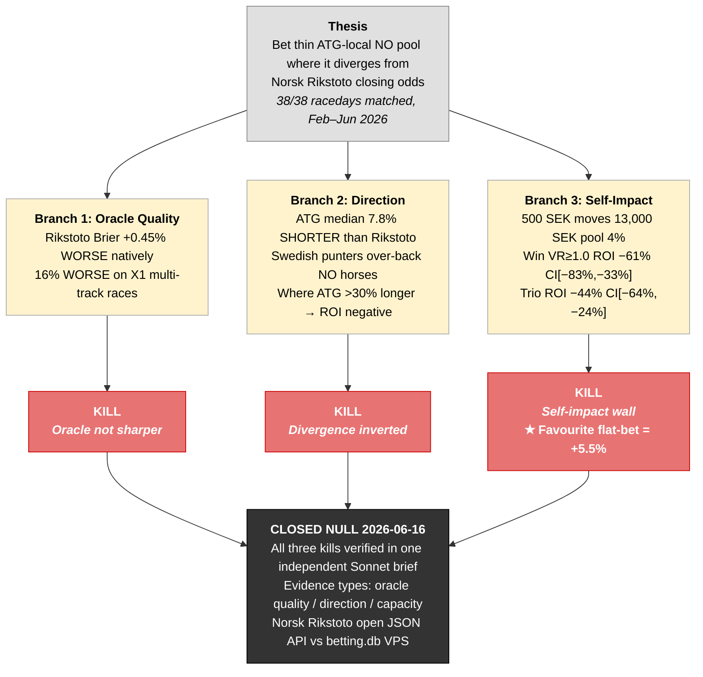

The Kambi API responded in seconds. Two events. Both dated 2027. Elitloppet and Prix d'Amerique — the sport's signature marquee races, once each year, priced with genuine care. The entire weekly V75 and V86 card, every Saturday, every mid-week V86, the races the model had been built to beat: absent. Not poorly covered. Not on a different endpoint. The product did not exist.

That was the moment the fixed-odds escape thesis died. The cross-tote oracle thesis took another six weeks and 332 ATG races to kill. Both ideas had the same shape — import a signal from outside the ATG closed system — and the same problem: the outside they were pointing at was not there in the form required.

---

## The Fixed-Odds Thesis

A fixed-odds bookmaker solves the tote's central structural problem. You agree on a price; the price is fixed. No closing-dividend variance, no off-track money arriving after the gate opens, no pool dynamics. If the model says a horse is 20% to win and the fixed-odds market offers 6.0 (16.7% implied), that is a winning edge at a locked price. Simple and testable — if a bookmaker offered the product.

The B2B betting engine behind ATG, Unibet, Svenska Spel, Betsson, NordicBet, and Hajper SE is Kambi. If any licensed Swedish operator offered SE trav as fixed odds, it would almost certainly route through Kambi. The agent queried the offering API directly.

---

## The Kambi Result

The `listView/.../all/matches.json` endpoint returned two events. Elitloppet 2027 and Prix d'Amerique 2027.

| Race | Overround | vs ATG tote (~1.20) |
|------|-----------|---------------------|
| Elitloppet 2027 | 1.003 | 0.3% margin — far cheaper |
| Prix d'Amerique 2027 | 1.426 | More expensive than the tote |

The contrast is worth sitting with for a moment. The product that could have freed this project from the tote's 20% rake was, in one of its two available instances, more expensive than the tote. The weekly programme — the only plausible volume source for a systematic edge — does not exist as a fixed-odds product anywhere in the licensed Swedish market. Swedish trotting is exclusively pari-mutuel under the ATG monopoly. That is not a scraping problem. It is a product-existence fact.

*(Kambi API query, 2026-Q1; source: rv_oddscompare table, VPS — 54 Kambi-only rows, zero tote event matches.)*

---

## Coolbet, the Incapsula Bypass, and What "No Target" Means

The second check was Coolbet, which carries horse racing under its SE license. The agent checked the Horse Racing node (id 52192): Australian and New Zealand gallop tracks — Albury, Ballarat, Caulfield. The Trav category (id 25313) was empty. "Coolbet carries SE trav" had been an unverified assumption. It failed the first fact-check.

Coolbet's API returns 403 to a standard `curl` request — Incapsula anti-bot protection. The agent worked around this without prompting: a Playwright session holds bot-cleared cookies, and an in-page `fetch()` via `browser_evaluate` to `/s/sbgate/...` returns 200. The workaround is real and reusable. The VPS scripts live at `/home/claude/betting/experiments/fixedodds/`.

Cracking an anti-bot system is an engineering problem; the agent solved it. Finding that the catalog behind the cracked API contains no SE trav is a product problem; no amount of engineering solves it. The correct order is to check product existence before investing in access. The agent built the access layer first. The cost was low this time.

---

## The Cross-Tote Oracle Thesis

The foreign pool angle required understanding what kind of pool ATG actually runs for international races. ATG Betting Regulations §7 determines the pari-mutuel structure for each bet type on each country.

The default rule is a co-mingled pool: ATG's Swedish stakes are fed into the host country's tote, and the ATG dividend equals the host dividend. No cross-pool oracle is possible here — ATG participants receive the same price as everyone else. The exception is a LOCAL Swedish pool, where ATG runs its own independent pool priced entirely by Swedish money.

The tell is architectural. Bet types the host country also offers (France's Gagnant maps to vinnare) co-mingle into the host tote. Bet types ATG constructed that the host lacks — Komb and Trio — run LOCAL even on foreign races. The thin local pools are precisely ATG-only constructs on foreign tracks.

464,787 odds snapshots collected between 2026-02-23 and 2026-06-16 confirmed the architecture quantitatively. The regime map, derived from those snapshots and §7, classifies each country-by-bet-type combination:

<figure>
  <div class="placeholder">📊 Chart: Pool Regime Map — ATG Turnover Medians (SEK) by Country and Bet Type · render with matplotlib code in <code>blog/series/_specs/06-escape-attempts-fixed-odds-cross-tote.specs.md</code></div>
  <figcaption>Pool regime map showing median turnover (SEK) per country and bet type across 464,787 snapshots (Feb–Jun 2026). SE and DK rows are home-merged; GB and HK co-mingle into foreign totes; FR singles co-mingle into PMU while FR komb/trio run LOCAL thin; NO and FI run ALL LOCAL thin — the only countries where a cross-tote oracle angle is structurally possible.</figcaption>
</figure>

The Norwegian row stood out immediately. Every bet type — vinnare (13k SEK), tvilling (7.6k SEK), komb (8.3k SEK), trio (14k SEK) — runs LOCAL. Swedish punters on Norwegian races are betting in an isolated ATG pool, priced by Swedish money only. Meanwhile, the real Norwegian home market runs on Norsk Rikstoto, with an open JSON API returning closing odds in real time.

The oracle thesis: collect Rikstoto closing odds and ATG-local NO closing odds on the same races, compute the divergence, and bet the ATG price when it is substantially longer. Following Benter's insight that the public tote price is a hard prior for any private signal (Benter, 1994), the question was whether Rikstoto's closing price carries more information than the ATG-local price on Norwegian races — and whether any systematic divergence is exploitable.

---

## Three Independent Kills

<figure>



<figcaption>Three-kill diagram for the Norwegian cross-tote oracle test. Each branch represents one independent failure condition, any of which would have been sufficient to close the experiment. All three were confirmed in a single verifier brief over 35 racedays (38 date-track pairs matched to Rikstoto).</figcaption>
</figure>

The test ran over 332 ATG races across 35 racedays, producing 38 date-track combinations matched to Rikstoto. The Syndicate's independent Sonnet verifier processed all three kill conditions in a single brief, specified in advance: oracle quality, divergence direction, and self-impact capacity. All three failed.

**Kill 1 — Oracle not sharper.** Using Rikstoto as an oracle requires it to be a better predictor of Norwegian race outcomes than ATG's thin local price. On native (separate-pool) races, Rikstoto's Brier score was **+0.45% better** than ATG-local — a marginal advantage. Across the full dataset it was **4.1% worse**, and **16% worse** on X1 multi-track races. The Kill 1 verdict rests on the overall and X1 results: no consistent oracle advantage. Even a thin ATG-local pool, on this evidence, aggregates Norwegian-race information at least as well as the Rikstoto pool does. The T-60s analysis from this project's prior post supports the same conclusion: closing prices in active pools, even thin ones, are shaped by the last informed money — not naive averages of participants' prior beliefs.

**Kill 2 — Direction inverted.** The thesis assumed that Swedish punters, isolated from the Norwegian market signal, would systematically under-back Norwegian horses they know less about. The direction should be ATG longer than Rikstoto — overly cautious Swedish money leaving value on the table.

The data showed the opposite. ATG's NO closing prices were a **median 7.8% shorter** than Rikstoto across 37.9% of starters where ATG priced the horse shorter. Swedish punters over-back Norwegian horses. The plausible explanation is familiarity bias running in the wrong direction: V75 punters follow specific harness drivers and trainers across the Nordic circuit, so Scandinavian-adjacent horses get punted enthusiastically in the ATG pool while the Norwegian home crowd is more sober about local form. Whatever the cause, it means the ATG price is not the naive estimate the thesis required it to be. Where ATG prices were longer than Rikstoto by more than 30% — the subset the thesis would have targeted — the ROI was negative. The divergence existed; the direction the model needed did not.

**Kill 3 — Self-impact wall.** As Hausch, Ziemba, and Rubinstein showed in their foundational analysis of how individual bets move pari-mutuel prices in proportion to pool size (Hausch, Ziemba & Rubinstein, 1981), a 500 SEK bet in a 13,000 SEK pool shifts the price by approximately **4%**. Any edge identified by comparing ATG-local to Rikstoto would be partially self-destroyed before a single unit settled.

The backtest numbers confirm it. Win bets meeting a value-ratio threshold of VR >= 1.0: ROI of **-61%**, 95% confidence interval [-83%, -33%]. Trio bets: **-44%** CI [-64%, -24%]. The flat-bet favourite — the dullest possible baseline — returned +5.5%, beating the value-ratio approach entirely.

The three-kill structure is worth preserving as an epistemics pattern. A thesis that can be killed by oracle quality, or by direction, or by self-impact separately — and is killed by all three simultaneously — is more definitively null than a thesis killed by a single headline ROI. Pre-registering multiple orthogonal failure modes before seeing any results is what separates this from a stopped-clock reversal.

---

## What the Regime Map Actually Produced

The cross-tote experiments closed null. The productive output was the regime map itself.

One autonomous research session to build; indefinite shelf life. The table above is a durable reference. Before writing any cross-pool code, it answers whether an oracle angle is structurally possible. France's komb pool (approximately 1.3k SEK) and trio pool (approximately 3.6k SEK) are LOCAL thin exotic pools sitting alongside a co-mingled, sharp 684k SEK French win pool — a Harville-VR spray setup whose architecture is entirely internal, no external oracle required. The French angle subsequently failed on its own terms, but it failed as a tested hypothesis rather than an overlooked one.

The query that built the regime table — extracting final-snapshot pool turnover per country and bet type from the api_responses table — is the reproducible starting point:

```sql
-- Final-snapshot pool turnover per country x bet type
-- Source: betting.db (VPS), api_responses table
-- Each endpoint stores a different pool key:
--   win_odds   → $.pools.vinnare.turnover
--   trio_game  → $.pools.trio.turnover
--   komb_game  → $.pools.komb.turnover
-- Run per-endpoint or use a UNION across endpoints.
-- Trio turnover is under endpoint='pool', not 'trio_odds'
SELECT
    JSON_EXTRACT(response_json, '$.countryCode')           AS country,
    endpoint                                               AS bet_type,
    MEDIAN(
        -- pools.{key}.turnover is denominated in öre (1/100 SEK)
        CAST(JSON_EXTRACT(response_json, '$.pools.vinnare.turnover') AS REAL) / 100.0
    )                                                      AS median_turnover_sek
FROM api_responses
WHERE snapshot_rank = 1   -- last snapshot before race start
  AND endpoint = 'win_odds'
GROUP BY country, endpoint
ORDER BY country, bet_type;
```

Repeat with `$.pools.trio.turnover` / `endpoint = 'trio_game'` and `$.pools.komb.turnover` / `endpoint = 'komb_game'` for the exotic pools, then union the results to build the full regime table.

---

This investigation produced two null results and one durable artifact. The artifact earned its keep: every subsequent cross-pool experiment started from the correct regime premise because the map was encoded in the project memory node immediately after this investigation closed. Null results that leave the system smarter than they found it are the tolerable kind.

The epistemics pattern generalizes. Before committing an agent session to any cross-market investigation, determine the pool regime first. If the bet type co-mingles, there is no oracle angle and no self-impact wall — but also no private signal. If it runs LOCAL and thin, you have a private signal potential and a self-impact problem at any worthwhile stake. The French komb and trio pools are the next version of this question; the regime map told us the structure before any backtest ran.

The only remaining fixed-price source for SE harness is Betfair Exchange (UK). It is in the research backlog, not in these results.

---

## References

Hausch, D.B., Ziemba, W.T., and Rubinstein, M. (1981). Efficiency of the Market for Racetrack Betting. *Management Science*, Vol. 27, No. 12, pp. 1435–1452.

Thaler, R.H. and Ziemba, W.T. (1988). Anomalies: Parimutuel Betting Markets: Racetracks and Lotteries. *Journal of Economic Perspectives*, Vol. 2, No. 2, pp. 161–174.

Snowberg, E. and Wolfers, J. (2010). Explaining the Favorite–Long Shot Bias: Is it Risk-Love or Misperceptions? *Journal of Political Economy*, Vol. 118, No. 4, pp. 723–746.

Benter, W. (1994). Computer Based Horse Race Handicapping and Wagering Systems: A Report. In Hausch, D.B., Lo, V.S.Y., and Ziemba, W.T. (eds.), *Efficiency of Racetrack Betting Markets*. Academic Press (reprinted World Scientific, 2008), pp. 183–198.
