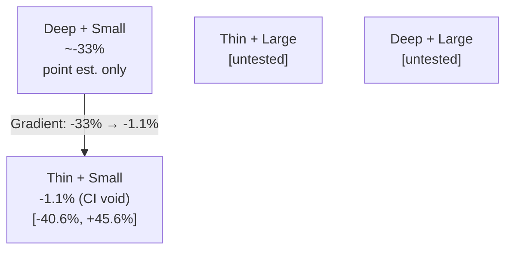

Thin pools, small fields, midweek races — our best model's edge bets went from -33% in deep pools to -1.1% in the least-liquid corner of the market, and we were nearly convinced it was real until we ran the race-clustered bootstrap.

The confidence interval was [-40.6%, +45.6%]. On 421 win bets. We filed it under "statistically void" and moved on.

---

## Asking the Right Question

The canonical question in betting market research is: is the market efficient? It is also, for practical purposes, the wrong question. As Hausch, Ziemba, and Rubinstein first showed in their 1981 study of US parimutuel win markets, the answer is approximately "yes for win bets, less so for place/show" — a result that has held up across multiple replications in US and UK markets. Asking it again with Swedish trotting data was not going to produce a different answer.

A more productive framing: where is this market least efficient, and why? Efficiency is not a single number stamped on a market; it varies by participant quality, pool depth, race timing, and bet type. As Thaler and Ziemba surveyed in their 1988 review of parimutuel markets, price accuracy is a function of the information aggregated by the betting public. As Asch, Malkiel, and Quandt showed, the disciplining effect of informed participants weakens as their share of pool volume shrinks.

The structural prediction follows directly: thin pools, where fewer participants aggregate information, should show lower price accuracy. Small fields compound this — with fewer horses, the combinatorial space is smaller, but the relevant effect is that small-field races attract less casual volume, leaving the pool more sparsely populated. The theory points clearly to where we should look.

We built a regime analysis that sliced the SE win-pool data by three dimensions: pool size, field size, and race timing (midweek vs. weekend). The script lives at `data-science/experiments/relative_value/regime_analysis.py` on the VPS. The relevant cut was:

```python
# Thin-pool, small-field regime filter
mask_thin   = df["pool_size"] < 50_000          # SEK
mask_small  = df["field_size"] <= 9             # horses
mask_edge   = df["model_edge"] >= 0.05          # model disagrees with market by >= 5pp absolute

cell_df = df[mask_thin & mask_small & mask_edge]
# 421 bets, point ROI -1.1%
```

The gradient that came out was striking.

---

## The Gradient

Model edge bets (where our Brier-calibrated probability exceeded the implied tote probability by at least 5 percentage points absolute) returned approximately -33% in deep pools (above 400k SEK). That number is a point estimate without a CI attached to it in our source material, so treat it as directional rather than precise. The deep-pool result is consistent with a prior finding: our strongest public-data model — fundamentals plus market history, pedigree, and equipment flags — achieved an out-of-sample Brier score of 0.0816 against the closing tote's 0.0721. The model was 13% worse than the market at predicting outcomes. Betting confidently against a sharper aggregator in the deepest, most informed pools produces -33%.

Moving to the thin+small cell, bet-all (no model filter) returned -18.7% on the same regime. Still negative, still well below the approximate 15–25% takeout, but the gap to the market-efficiency benchmark starts to close. Add the model filter (edge >= 0.05) and the point estimate reaches -1.1% on 421 win bets.

-1.1% is close to breakeven in dollar terms. The CI of [-40.6%, +45.6%] makes the point estimate meaningless — we cannot distinguish it from -40% or +45%. But the gradient itself — -33% in deep pools to -1.1% in the thinnest, smallest-field corner — is exactly what the structural theory predicted. The regime lens correctly located the least efficient corner of the market.

<figure>
  
  <figcaption>ROI by regime cell with race-clustered bootstrap 95% confidence intervals. The gradient from deep to thin pools is real; the CI on the thin-small cell is wide enough to span the entire chart.</figcaption>
</figure>

The more aggressively filtered slice (edge >= 0.10) showed a point estimate of +72.8% (CI [-36.4%, +215.2%]). That number was exciting for about three minutes. The CI for this subsample spans 251 percentage points, wider than the 86-point interval on the larger cell — a more extreme point estimate does not make the slice more promising; it makes it more void.

---

## Why Thin Pools Are the Worst Place to Bet (For the Same Reason They Are the Best)

There is a structural trap built into the thin-pool efficiency story, and as Benter documented in his landmark practitioner account of computer-based wagering, it applies to any model-based parimutuel system: the capacity ceiling is set by the pool you are trying to exploit.

Parimutuel mechanics mean your bet becomes part of the pool and lowers the dividend you receive. In a 400k SEK deep pool, a 1,000 SEK bet represents 0.25% of pool volume — negligible. In a 30k SEK thin pool (a plausible midpoint for the < 50k regime), a 100 SEK bet is already 0.3% of pool. A 1,000 SEK bet is 3.3%. A 5,000 SEK bet is 16.7%.

| Stake (SEK) | 30k pool | 100k pool | 400k pool |
|-------------|----------|-----------|-----------|
| 100         | 0.33%    | 0.10%     | 0.025%    |
| 1,000       | 3.33%    | 1.00%     | 0.25%     |
| 5,000       | 16.7%    | 5.00%     | 1.25%     |

The irony is tight: the mechanism that makes thin pools inefficient (sparse, uninformed money) is the same mechanism that makes any edge in them self-extinguishing. You cannot bet your way into the pool without becoming a meaningful fraction of it, which means the odds you receive at settlement are not the odds you observed. This is the insight Benter and others discuss in the Hausch-Ziemba volume: capacity and edge are inversely correlated in thin parimutuel markets.

In our case, the race-clustered bootstrap made the capacity question moot — there was nothing to bet into at any stake size. But the structural argument matters for any future thin-pool research: even if a cell eventually accumulates enough data to clear the CI gate, the capacity ceiling arrives before meaningful scale.

---

## The Race-Clustered Bootstrap

This is the methodological piece that most betting research skips, and it is not subtle. In a race-based betting system, multiple bets per race are correlated: they share the same field, the same track conditions, the same pool, the same day. Naively bootstrapping individual bet outcomes treats each bet as an independent draw from the distribution of returns. It is not. Resampling bets rather than races overcounts the number of independent observations and produces confidence intervals that are too narrow — which is exactly the direction of the error you do not want when a point estimate looks promising.

The correct statistical unit is the race. A race-clustered bootstrap draws races with replacement, then includes all bets from those drawn races — including duplicate rows for races drawn more than once:

```python
import numpy as np
import pandas as pd

def race_clustered_bootstrap(df, n_iter=10_000, ci=0.95):
    """
    df: DataFrame with columns ['race_id', 'stake', 'payout']
        (cell_df joined to bet-level outcome data before passing in)
    Returns (point_roi, ci_lower, ci_upper)
    """
    races = df["race_id"].unique()
    point_roi = (df["payout"].sum() / df["stake"].sum()) - 1.0

    boot_rois = []
    rng = np.random.default_rng(seed=42)
    for _ in range(n_iter):
        sampled_races = rng.choice(races, size=len(races), replace=True)
        # pd.concat correctly stacks rows for races drawn multiple times
        boot_df = pd.concat([df[df["race_id"] == r] for r in sampled_races])
        boot_roi = (boot_df["payout"].sum() / boot_df["stake"].sum()) - 1.0
        boot_rois.append(boot_roi)

    alpha = (1 - ci) / 2
    return (
        point_roi,
        np.quantile(boot_rois, alpha),
        np.quantile(boot_rois, 1 - alpha),
    )
```

Applied to the thin+small cell (421 win bets, 7.6% strike rate), this produced a 95% CI of [-40.6%, +45.6%]. The interval spans 86 percentage points. The point estimate of -1.1% sits roughly in the middle.

The 7.6% strike rate is the key structural driver of this width. Win bets in a thin-pool, small-field regime are rare events with fat-tailed payouts — tote win dividends can be enormous on longshots, and the return distribution is heavily right-skewed. With only 421 bets and a 7.6% strike rate, we observed approximately 32 winners. Each winner's dividend contributes disproportionately to the total return. A small shift in which winners fall in which bootstrap resample swings the aggregate ROI enormously. 421 bets sounds like a lot; at 7.6% strike, it is far too small to stabilize the estimate.

With a CI spanning 86 percentage points, the point estimate carries no inferential weight. The CI is not a formality we run to check a box. It is the result.

---

## How the CI Became Mandatory Protocol

The fact that we ran a race-clustered bootstrap on this cell at all is not obvious. The Syndicate — our multi-agent research loop — had earlier encountered a failure mode that made the CI gate non-negotiable.

The Structural CI Bottleneck, as it was logged in our sprint records, went like this: ideas would frequently pass four of five promotion criteria but fail the fifth — bootstrap CI excluding zero — not because the idea was bad but because the dataset was small. NO+FR-only test sets with 5–7 winners produce bootstrap intervals too wide to close by any reasonable threshold, regardless of how good the point estimate looks. Early sprints occasionally flagged these as "borderline" — the kind of framing that creates pressure to accumulate more data until the CI happens to clear.

After enough encounters with that failure mode, the coordinator (the main Opus session that triages, judges, and commits) encoded a gate rule: no Sonnet backtester's point estimate enters the verdict chain without a CI request attached. Not "request a CI when the point estimate is suspiciously good." Always. The gate is mechanical, pre-registered.

The five promotion criteria the Syndicate applied were: positive train ROI, positive test ROI, race-clustered bootstrap CI excluding zero, at least 40 test winners, and at least 80% of rolling windows profitable. The thin-pool regime result failed on the third. It did not come close.

---

## What the Memory Store Saw

The thin-pool point estimate of -1.1% is genuinely interesting-looking without context. In isolation, it is the kind of number that survives across sessions: someone picks up the thread two weeks later, finds a note that says "model edge bets in thin+small cell returned -1.1%", and starts building on it.

The memory architecture we use was specifically designed to prevent this. Every sprint result is written to a structured markdown node in a memory store indexed by `MEMORY.md`. The regime result was written as follows (paraphrased from the actual node in `project_tote_efficiency_synthesis.md`):

> **Regime thin-pool cell DOES NOT survive CI (2026-06-16):** SE thin(<50k) & small(<=9) edge>=0.05 ROI -1.1% but CI [-40.6%, +45.6%] (421 win bets, 7.6% strike = huge variance). STATISTICALLY VOID. Self-impact modest but moot. The regime lens is a good analytical tool but yields no CI-positive edge.

The key phrase is "DOES NOT survive CI," placed immediately after the point estimate, in the same sentence. A fresh session rehydrating from this store sees the full context or it sees nothing useful. The enticing number and its invalidation are co-located. Without that structure, the -1.1% is the thing that survives across sessions while the caveat evaporates.

Memory encoding is an architectural choice, not a documentation nicety. The coordinator is stateless across sprints; the knowledge store is not. Structured memory with invalidation co-located is how a pipeline avoids re-discovering and re-promoting results that were already ruled out. The same principle that required the CI gate in promotion criteria required co-location of the invalidation in memory: once the gate was mandatory, the store had to enforce that the invalidation traveled with the number.

---

## What the Regime Lens Actually Produced

The thin-pool regime analysis returned nothing tradeable. That is the honest summary. But it produced three things that survived.

**A correct analytical map.** The three framings we tried across the broader tote efficiency work were: odds as a process (looking for systematic drift or momentum — null), horse as a process (form and quality modeling — sub-takeout), and market efficiency as a regime (conditional on pool depth and field size — this post). The regime framing was the productive one in the sense that it generated a testable, directionally correct prediction from structural theory. It just needed more data to verify and capacity to exploit, neither of which we had.

**A validated framework for future research.** The gradient from deep to thin pools — approximately -33% to -1.1% on model edge bets — is exactly what the structural theory of information aggregation predicts, as Asch, Malkiel, and Quandt documented: informed participant share disciplines prices, and as that share shrinks, price quality falls. That directional confirmation is worth having. It is also not the same as an exploitable edge. No future sprint should treat the regime gradient as prior evidence of an extractable edge — the point estimate's CI spans roughly [-41%, +46%]; the gradient locates inefficiency but does not promise it can be harvested.

**A capstone confirmation of the overall verdict.** The deep-pool results (-33%), the late-money results (closing Brier 0.06434 versus T-60s Brier 0.06572 from a separate 374-race scanner evaluation window — not directly comparable to the 0.07xx model Brier scores, which use a different sample and horizon), the fundamentals model results (Brier 0.0816 versus market's 0.0721 out-of-sample), and now the thin-pool CI result — all point to the same conclusion. Every public-data angle dissolved under correct settlement, under a CI, or under a self-impact calculation. The market won on all three.

464,787 odds snapshots collected. 10,358 paper bets recorded. 23 real-money bets placed, then paused. 83 experiments tracked in MLflow. The regime cell on 421 win bets was the last candidate standing, and it was statistically void.

<figure>



<figcaption>2x2 regime matrix showing model edge bet ROI by pool depth and field size, with CI status. The gradient is real; the exploitable cell does not exist.</figcaption>
</figure>

---

## References

Asch, P., Malkiel, B.G., and Quandt, R.E. (1982). Racetrack betting and informed behavior. *Journal of Financial Economics*, 10(2), 187–206.

Benter, W. (1994). Computer-based horse race handicapping and wagering systems: a report. In D.B. Hausch, V.S.Y. Lo, and W.T. Ziemba (eds.), *Efficiency of Racetrack Betting Markets*. Academic Press.

Hausch, D.B., Lo, V.S.Y., and Ziemba, W.T. (eds.) (1994). *Efficiency of Racetrack Betting Markets*. Academic Press (reissued World Scientific, 2008).

Hausch, D.B., Ziemba, W.T., and Rubinstein, M. (1981). Efficiency of the market for racetrack betting. *Management Science*, 27(12), 1435–1452.

Snowberg, E. and Wolfers, J. (2010). Explaining the favorite-longshot bias: supply- and demand-based explanations. *Journal of Political Economy*, 118(4), 517–558.

Thaler, R.H. and Ziemba, W.T. (1988). Parimutuel betting markets: racetracks and lotteries. *Journal of Economic Perspectives*, 2(2), 161–174.

---

## Takeaways

- **Regime conditioning correctly locates inefficiency; it does not confirm exploitability.** The gradient from -33% in deep pools to -1.1% in thin+small fields was real and theory-predicted. The CI of [-40.6%, +45.6%] on 421 bets made the point estimate uninformative.
- **High-variance, low-strike-rate samples require large n before point estimates stabilize.** At 7.6% strike (roughly 32 winners on 421 bets), each tote dividend swings the aggregate ROI enormously under resampling. The sample size that looks adequate is not.
- **Race-clustered bootstrap is mandatory for any multi-bet-per-race system.** Resampling individual bets overcounts independent observations and produces false precision in exactly the direction that causes harm — too-narrow CIs on apparently promising results.
- **Memory encoding is architecture.** Write the invalidation in the same sentence as the exciting number, in a structured store that travels across sessions, or the number is the thing that survives and the caveat evaporates.
