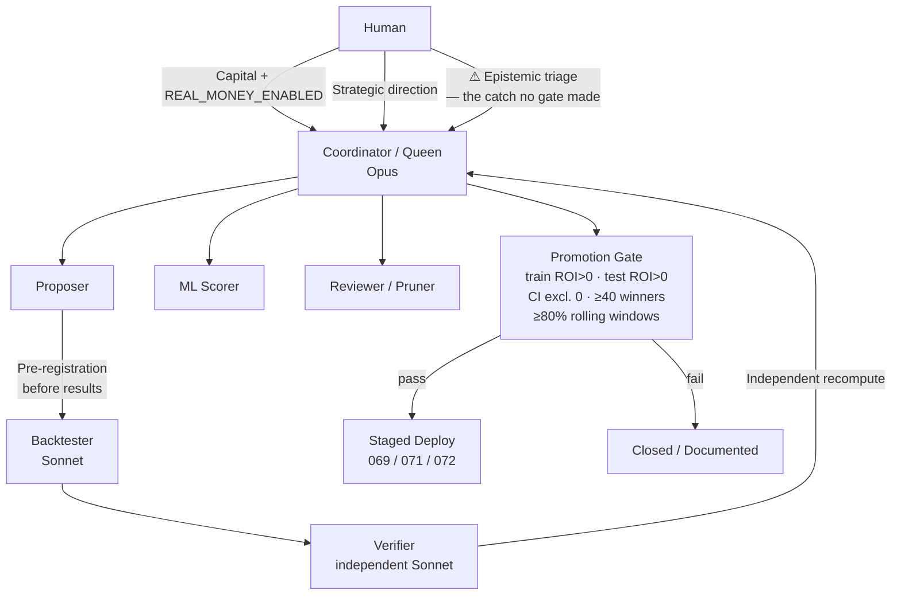

# The Durable Artifact: What Four Months of Honest Failure Actually Produced

The T-1 odds bug turned −7.5K SEK into +243K SEK. A single commit. The Dr-Z place system produced a longshot "win" rate of 0.95 in the selected cell, against a sane base rate of 0.13 to 0.34. Both of those numbers were wrong — and finding out exactly why they were wrong is the most transferable thing this program produced.

The betting program closed null. Every apparent edge dissolved under scrutiny. No capital went to work at scale, no system is running, and the Nordic trotting pari-mutuel market is exactly as efficient as the textbook says it should be. What the program produced instead of a trading system is a false-positive checklist with five items, a proprietary data pipeline with 464,787 odds snapshots, six cracked external APIs, and a template for running a pre-registered, independently verified AI research loop.

That last item — the methodology template — generalizes far outside horse racing, and it was built by accident while trying to beat a market.

---

## The Verdict, Stated Without Ceremony

The Swedish trotting pari-mutuel market is efficient to within the takeout. So are the Norwegian, Finnish, and French trotting pools. Around 84 experiments (83 tracked in MLflow) across roughly four months — February through June 2026 — turned up zero statistically validated, capacity-viable edge using public data or price-based strategies.

This is not a soft conclusion. The program was deliberately structured to make false confidence expensive: pre-registered hypotheses, mechanical promotion gates, independent AI verification of every load-bearing number. Three experiments were promoted through that gate (069, 071, 072) and staged. None were ever deployed to live money.

Twenty-three real-money bets were placed in an earlier, less rigorous phase. At 10 SEK per bet and 23 bets that is 230 SEK in total stakes — a corrected ROI of roughly −12%, or approximately −28 SEK. The 17% strike rate, and the fact that 21 of 23 bets were placed under a strategy that later turned out to be wrong, makes this roughly what you'd expect from a losing edge. The program paused `REAL_MONEY_ENABLED = False` the moment a research result undermined the edge. It never restarted.

As Hausch, Ziemba, and Rubinstein confirmed in 1981, the win pool at major tracks is efficient to within the takeout — a finding that motivated their place-and-show arbitrage system. What took four months to confirm here is that this result extends to thin Nordic trotting pools, to exotic markets (komb, trio), to cross-tote relative value, to late-money momentum plays, and to pedigree-based models. Every angle eventually hit the same wall.

---

## What Went Wrong With Every Promising Result

The most useful output of the program is not a data asset or an API. It is a catalogue of the ways a quant researcher can fool themselves, with specific numbers attached to each failure.

<figure>
  <div class="placeholder">📊 Chart: Every promising result in 84 experiments traced to one of five reproducible self-deceptions — naming them explicitly is more valuable than any single backtest. · render with matplotlib code in <code>blog/series/_specs/09-capstone-what-the-shop-built.specs.md</code></div>
  <figcaption>The five failure modes that generated every spurious edge in 84 experiments. Each row maps to a specific investigation; each fix is mechanical and checkable.</figcaption>
</figure>

**1. Stale / T-1 odds.** The scanner collected a pre-close snapshot. Early paper P/L used that snapshot to settle bets. Tote odds move substantially in the final 60 seconds — the last biddable price is a median 17.2% off the closing dividend, with favourites shortening ~6% and longshots drifting ~17% longer. Using that snapshot to simulate settling inflated paper P/L from −7.5K SEK to +243K SEK. The correction erased most of the apparent program-wide profit in a single commit.

**2. Look-ahead via current snapshots.** Any quantity that updates over time — a realized place dividend, a genetic merit index — carries look-ahead contamination when used to select historical bets. The Dr-Z place system selected bets on historical races using `rv_plats.plats_final_odds`, which turned out to be the realized post-race place dividend rather than a pre-race price. The ratio of that field to the realized post-race place dividend was 1.000 for 193,000 French placers. That is not a pre-race price. The apparent ROI in the selected subset was +61% to +289% across FR/NO/US (spanning multiple investigation runs, from the final definitive run to intermediate stages before the look-ahead was confirmed); the longshot "place" rate in the selected cell was 0.95 against a sane base rate of 0.13–0.34. When the honest pre-race price was used instead, the result was −takeout.

The same contamination appeared in the Breedly BLUP genetic data: the "current" BLUP of a horse bakes in every race it has run up to today, including races that are in the historical test set. Using today's BLUP to select historical bets creates look-ahead that is structurally indistinguishable from signal until you ask when the snapshot was taken.

**3. Incomplete-field de-vig.** Using the Harville model (Harville, 1973) to estimate trio and komb probabilities requires starting from correctly calibrated win probabilities. If you de-vig over a subset of starters rather than the complete non-scratched field, every win probability is inflated, every Harville joint probability is inflated, and every value ratio (VR) is inflated. Spurious value everywhere. The fix is mechanical: always normalize over the complete field.

**4a. Survivorship bias.** The `historical_combos` table in `analytics.duckdb` holds only pre-selected combos — roughly half the real races. Any backtest run directly against that table is selecting from a pre-filtered universe. The early komb spray results looked extraordinary before this was caught; once the full combo universe was joined to ground-truth race results, the surplus evaporated.

**4b. Argmax / threshold-mining.** Sorting by VR and betting the top-N on historical data is argmax selection on realized noise, not a strategy. Separately, scanning a grid of thresholds and reporting the one that looked best is threshold-mining on the test set, which is why the gate requires a pre-registered primary metric and threshold.

**5. Underpowered claims / missing CI.** Point estimates on win-bet samples are not results. A thin-pool regime cell (SE thin pools under 50K SEK, fields of ≤9 horses, edge≥0.05) showed a point estimate of −1.1% ROI across 421 bets. The race-clustered bootstrap CI was [−40.6%, +45.6%]. That is noise, not a candidate for deployment. The failure mode is claiming signal from a point estimate when the underlying variance is wide enough to accommodate almost any true mean. Requiring a CI that excludes zero before claiming signal would have saved several sprint cycles.

As Snowberg and Wolfers demonstrated in their 2010 analysis of the favorite-longshot bias, even the most robust pari-mutuel anomaly — the systematic overpricing of longshots — is, in liquid markets, already priced in. In thin Nordic pools the bias remains present but execution economics of self-impact make it unexploitable: a 500 SEK bet in a ~13K SEK Norwegian win pool moves the dividend ~4%, instantly destroying the identified edge.

---

## What the Market Taught

As Thaler and Ziemba noted in their 1988 survey, the takeout is the structural floor every edge must clear. In Swedish trotting pools that floor sits at roughly 15–25%. The best public-data fundamentals model built during this program had an out-of-sample Brier score of 0.0812 against the closing price's Brier of 0.0721. (Brier score: lower is better, zero is perfect.) Blending the model with the market price improved to 0.0720 — marginally better than the model alone, but not better than the close, and negative on every betting slice tested: bet-all returned −27%, the "edge≥0.1" deep-value slice returned −20%.

These Brier figures come from the fundamentals-model evaluation and should not be confused with a separate late-odds-movement study, which ran on a different sample and found Brier scores of 0.06572 at T-60 seconds and 0.06434 at close.

The structural reason for the model's ceiling is clear. In pari-mutuel betting, you are paid the closing dividend regardless of when you placed your bet. There is no way to lock a price advantage. The close aggregates all public money plus informed late money — it is the sharpest predictor available. Fading the late move (betting against the last-minute shortening of favourites) produced −45% ROI. The late money is smarter than the model.

Form, pedigree, equipment, and driver information are all on `travsport.se` and Breedly, free and open. The crowd prices all of it. Models built from public sources converge toward the close from below and never cross it by more than the takeout. This is exactly what Benter documented in his 1994 report on computer-based handicapping: the genuine edges in that program came from private data collection — specifically sectional timing data not publicly distributed in usable form — but the necessary condition for profitability was a volume rebate that dropped effective takeout from ~17% to below his model's signal threshold. Neither lever was available here.

Two levers remain untested. The first is genuinely private information — trackwork timing, stable or veterinary intelligence, live scratched-money flow not yet reflected in the pool. None of this is scrapeable from public sources. The second is a volume rebate: if effective takeout dropped from 15–25% to ~5%, the b≈0.15 signal from the public-data model might cross zero. Whether any rebate arrangement is commercially reachable is an open question, not a finding.

---

## The Infrastructure That Survives

The null verdict on market efficiency does not deprecate the assets built while chasing a different conclusion.

**The data pipeline.** The live scanner has collected 464,787 odds snapshots from `api.travsport.se` between 2026-02-23 and 2026-06-16. The `analytics.duckdb` database holds 9.9M rows of `horse_starts_full` and 5.7M rows of `race_results` (Exp 084 migration from 35 GB of raw JSON). The verified-closing odds — settled at the realized dividend, not a snapshot — constitute a time-series that no commercial data vendor in this space appears to sell.

`horse_starts_full` has 9.9M rows but only ~1.47M unique `(date, track_id, race_number, horse_number)` tuples — a 6.7× duplication ratio that silently corrupts any naive aggregation. The correct dedup pattern, which should be applied before any aggregation:

```sql
-- Correct pattern: always dedup before aggregating
WITH deduped AS (
    SELECT *,
           ROW_NUMBER() OVER (
               PARTITION BY date, track_id, race_number, horse_number
               ORDER BY created_at DESC
           ) AS rn
    FROM horse_starts_full
)
SELECT track_id, COUNT(*) AS races, AVG(finish_position) AS avg_pos
FROM deduped
WHERE rn = 1
  AND finish_position IS NOT NULL  -- ~6.2M non-null of 9.9M rows
GROUP BY track_id;
```

**The external APIs.** Six data sources were opened and documented:

- **Norsk Rikstoto:** open JSON API returning win and trio odds, results, and historical data — undocumented publicly but fully functional.
- **Veikkaus/Fintoto:** same structure; win and trio odds, results, historical data.
- **Breedly GraphQL:** 621,597 horses with BLUP genetic indices, pedigree, auction histories.
- **ATG `api.travsport.se`:** the canonical live source, documented with rate limits and field conventions.
- **Kambi B2B fixed-odds:** active, but the market-structure investigation found roughly 2 Swedish trotting events listed per year — an answer to a question rather than an open door. In-page fetch via Incapsula bypass was proven as a technique against one target, but no trotting fixed-odds operator exists to use it against.

**The methodology.** Race-clustered bootstrap confidence intervals for win-bet samples with high variance. Complete-field de-vig before any Harville computation. Snapshot provenance checks before any historical selection. These are reusable discipline items independent of the domain.

---

## How the Research Shop Ran

The operational template is worth extracting separately from the betting domain, because it addresses a real problem in any AI-assisted research: how do you prevent an AI coordinator from pattern-matching toward optimism, moving goalposts, and finding signal in noise?

<figure>



<figcaption>The Syndicate role structure with the human irreducibility layer annotated. Six agent roles plus the one thing only human pattern recognition caught.</figcaption>
</figure>

The answer was a six-role structure called the Syndicate. The Coordinator (the main Opus session) writes and judges but never runs compute. The Proposer writes a pre-registration — hypothesis, primary metric, gate thresholds, explicit failure modes — before any results are seen. The Backtester (a cheap Sonnet agent) runs the actual historical simulation. The Verifier (a second, independent Sonnet with no shared context) re-computes the load-bearing numbers from a fully self-contained brief. The ML scorer and Reviewer run in parallel.

The promotion gate was mechanical and pre-registered:

- train ROI > 0
- test ROI > 0
- bootstrap CI excludes zero
- ≥40 test winners
- ≥80% of rolling windows profitable

Pass all five → staged to `betting/deploy/staged/`. Fail any one → closed, documented, ruled out.

The "Opus coordinates / Sonnet computes" pattern is a practical cost template. Judgment lives in the expensive-but-sparse tier — the coordinator that reads results, smell-tests numbers, and commits. All compute is parallelized in the cheap tier — background Sonnet agents for backtests, verification runs, ML grid searches. The human's cognitive load was almost entirely epistemics, not execution: no hand-written Python, no SSH, no MLflow babysitting. The question was always "does this result smell right."

Research state was persisted as structured markdown memory nodes, indexed so that a fresh session rehydrates four months of findings in seconds. The coordinator is stateless across sprints; the knowledge is not.

One honest caveat: background agents serialized in practice despite the configuration. **The parallelism was architectural rather than literal.** The Verifier briefs had to hardcode database paths and filter conditions because agents spawned without conversation context produce silent wrong results if they have to infer schema details.

**The one thing the gate never caught.** Every instance of look-ahead contamination that passed the structural checks was caught by the human coordinator asking "why is this number so good?" The T-1 bug was caught by skepticism about a suspiciously large number, not by an automated test. The Dr-Z longshot strike rate of 0.95 against a base rate of 0.13 was caught by the same pattern recognition. The automated Verifier catches arithmetic errors cold; it does not catch data-leakage patterns that are structurally plausible. That remains a human task.

---

## The One Honest Open Thread

The forward BLUP logger is the only open thread left running, and it is open precisely because it was designed to be honest about what it is testing.

`analysis/blup_snapshot_logger.py` takes a weekly point-in-time snapshot of every Swedish horse's BLUP genetic merit index via the Breedly GraphQL API (374,549 Swedish horses fetched; 289,000 with BLUP values). It runs as a systemd timer on the VPS, firing Mondays at 06:00. The first snapshot ran on 2026-06-16.

The reason this is the only honest open thread is structural: a snapshot taken before a race cannot contain information about that race. Historical look-ahead is architecturally impossible. This is the template for any futures-based test of a quantity that updates over time — the snapshot must predate the event, period. Whether genetic merit adds a real edge is genuinely unknown; revisit in late July 2026 with ~6 weeks of weekly snapshots.

Everything else was closed on 2026-06-16.

---

## What the Template Generalizes To

The Syndicate methodology is domain-agnostic. The betting program is the narrative spine; the scaffold fits any domain where data is messy, the edge is small, the sample is limited, and the temptation to move goalposts is constant.

<figure>
  <div class="placeholder">📊 Chart: 84 experiments, nine search angles, zero validated edges — the shape of an honest null result across four months. · render with matplotlib code in <code>blog/series/_specs/09-capstone-what-the-shop-built.specs.md</code></div>
  <figcaption>84 experiments mapped by angle and verdict. Every search ends in the same place — the market takes its cut — and knowing exactly how each angle failed is the finding.</figcaption>
</figure>

The five failure modes described above are domain-agnostic because they are structural, not domain-specific. Stale reference data, look-ahead from quantities that update over time, incomplete normalization, survivorship and argmax selection, underpowered claims — all five appear in financial alpha research, drug repurposing on small cohorts, A/B testing with insufficient power, and clinical subgroup analysis. The researcher in each setting faces the same temptation and the same set of traps.

What the template provides is not a guarantee against those failure modes but a forcing function: propose before computing, verify independently, enforce mechanically, and keep the coordinator's only job as judgment. The specific thresholds vary by domain — in horse racing the gate requires ≥40 test winners and bootstrap CIs excluding zero; in a drug repurposing setting the analogues would be calibrated to sample structure and effect size — but the pattern is the same.

The one adaptation note for any new domain: the Verifier brief must be fully self-contained. If the independent verifier has to infer anything about the data schema or filter conditions, it will do so silently and produce plausible wrong answers. Write the brief as if the Verifier is a competent analyst who has never seen the codebase. That single discipline catches more arithmetic errors than any other step in the loop.

---

## Takeaways

*"The experiment failed to find an edge — which, done honestly, is itself the finding."* That line from the trotting postmortem is the right place to start here, because it names what kind of result this is.

In a well-studied pari-mutuel market with a 15–25% takeout and a closing price that aggregates all public information, the null result is the expected outcome. The value was in learning exactly how, and how easily, data can fool you into believing otherwise. A researcher starting a similar program after reading this can skip the T-1 settlement bug, the look-ahead via realized dividends, the incomplete-field de-vig trap, the survivorship filter in the combo table, and the CI-free point estimate. That is several sprint cycles of negative expected value, already paid for.

The assets that survive — the odds pipeline, the cracked APIs, the methodology template — are worth more if someone applies them honestly than if they were folded into a trading system that turned out to be wrong. The false-positive checklist is the product. The null result is the certification.

---

## References

Benter, W. (1994). "Computer-based Horse Race Handicapping and Wagering Systems: A Report." In Hausch, D.B. and Ziemba, W.T. (eds.), *Efficiency of Racetrack Betting Markets*. Academic Press.

Harville, D.A. (1973). "Assigning Probabilities to the Outcomes of Multi-Entry Competitions." *Journal of the American Statistical Association*, 68(342), 312–316.

Hausch, D.B., Ziemba, W.T., and Rubinstein, M. (1981). "Efficiency of the Market for Racetrack Betting." *Management Science*, 27(12), 1435–1452.

Snowberg, E. and Wolfers, J. (2010). "Explaining the Favorite–Longshot Bias: Is It Risk-Love or Misweighting?" *Journal of Political Economy*, 118(4), 723–746.

Thaler, R.H. and Ziemba, W.T. (1988). "Parimutuel Betting Markets: Racetracks and Lotteries." *Journal of Economic Perspectives*, 2(2), 161–174.
